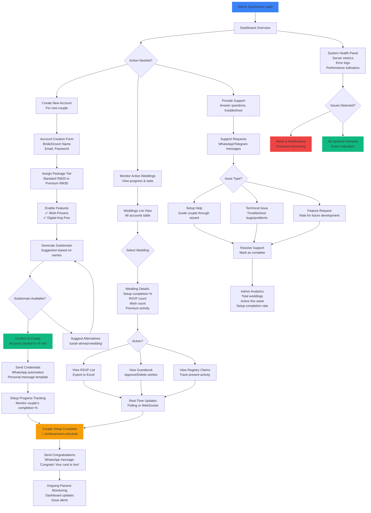

```mermaid
graph TD
    A[Receive WhatsApp Link] --> B{Tap Link}
    B --> C[Page Loads<br/><2 seconds on 4G]
    C --> D[Curtain Overlay Appears<br/>Full screen, rose gradient]
    D --> E{Read CTA}
    E --> F[Text: 'Tap to Open Their Wedding Card'<br/>Couple names visible<br/>Ring icon 💍]
    F --> G{Tap Curtain}
    G --> H[Curtain Animation Starts<br/>1.8s theater curtain part]
    H --> I[Card Reveals with Fade-in<br/>Hero photo + names]
    I --> J[Scroll & Explore Card]
    J --> K{View Sections}
    K --> L[See Photo Gallery<br/>Couple's happiness]
    K --> M[Read Date/Time/Venue<br/>Clear information]
    K --> N[View Countdown<br/>Building excitement]
    L --> O{Decision: RSVP Now?}
    M --> O
    N --> O
    O --> P[Tap RSVP Button<br/>Full-width, prominent]
    P --> Q{RSVP Method}
    Q --> R[WhatsApp Redirect<br/>Preferred method]
    Q --> S[Web Form Fallback<br/>If WhatsApp unavailable]
    R --> T[WhatsApp Opens<br/>Pre-filled message: 'I'll be there!']
    S --> U[Form Appears<br/>Name + phone fields]
    T --> V[Send Message<br/>One tap]
    U --> W[Submit Form<br/>Validation checks]
    V --> X[Confirmation Toast<br/>'Thank you! RSVP sent to Sarah & Ahmad']
    W --> X
    X --> Y{Optional: Leave Wish?}
    Y --> Z[Guestbook Form Visible]
    Z --> AA[Type Message<br/>Name + Wish text]
    AA --> AB[Submit Wish<br/>'Pending approval' feedback]
    Y --> AC[Done! Close Card]
    AB --> AC
    AC --> AD[Emotional Payoff:<br/>'I've participated.<br/>They'll know I care.']

    %% Error Paths
    C -.-> AE{Load Fails?}
    AE --> AF[Show Error Message<br/>'Unable to load card.<br/>Please try again.']
    AF --> AG{Retry?}
    AG --> C
    P -.-> AH{WhatsApp Not Installed?}
    AH --> S

    style A fill:#F43F5E,stroke:#fff,stroke-width:2px
    style I fill:#F43F5E,stroke:#fff,stroke-width:2px
    style X fill:#10B981,stroke:#fff,stroke-width:2px
    style AD fill:#F59E0B,stroke:#fff,stroke-width:2px
    style AE fill:#EF4444,stroke:#fff,stroke-width:2px
```

```mermaid
graph TD
    A[Receive WhatsApp Credentials<br/>From Amirrul] --> B[Open Login Link]
    B --> C[Enter Email/Password<br/>Auto-filled if possible]
    C --> D{First Login?}
    D --> E[Welcome Screen<br/>'Let's set up your wedding card together'<br/>Progress: 0%]
    D --> F[Dashboard Overview<br/>Continue where you left off]
    E --> G[Setup Wizard Starts<br/>Progressive Disclosure]
    F --> G

    G --> H{Section 1: Subdomain}
    H --> I[Enter Subdomain<br/>'sarah-ahmad']
    I --> J[Real-Time Validation<br/>AJAX checks availability]
    J --> K{Available?}
    K --> L[Green Checkmark ✅<br/>'Available!']
    K --> M[Red Message ❌<br/>'Taken, try another']
    M --> I
    L --> N[Progress: 20% → Celebration Animation]

    N --> O{Section 2: Template}
    O --> P[Template Grid<br/>4 options with thumbnails]
    P --> Q[Click Template<br/>Instant preview with couple's data]
    Q --> R{Like This Template?}
    R --> S[Keep Exploring<br/>Zero commitment anxiety]
    R --> T[Select Template<br/>'Great choice!']
    S --> Q
    T --> U[Progress: 40% → Confetti Burst]

    U --> V{Section 3: Wedding Details}
    V --> W[Form Fields:<br/>Date, Time, Venue, Map]
    W --> X[Live Preview Updates<br/>See changes instantly]
    X --> Y[Validation<br/>All fields complete?]
    Y --> Z[Progress: 70% → 'Almost There!' Message]

    Z --> AA{Section 4: Photo Upload}
    AA --> AB[Upload Widget<br/>Drag-drop or tap to select]
    AB --> AC[Client-Side Validation<br/><2MB check before upload]
    AC --> AD{File Valid?}
    AD --> AE[Kind Error Message<br/>'Photo is 5.2MB.<br/>Please choose under 2MB']
    AD --> AF[Upload Progress Bar<br/>Visual feedback]
    AE --> AB
    AF --> AG[Progress: 90% → 'One Last Step!']

    AG --> AH{Premium Features?<br/>Optional}
    AH --> AI[Wish Present Registry<br/>Locked: 'Upgrade to access']
    AH --> AJ[Digital Ang Pow<br/>Locked: 'Upgrade to access']
    AH --> AK[Skip for Now<br/>'You can add these later']
    AK --> AL[Progress: 100% → 🎉 CONFETTI!]
    AI --> AL
    AJ --> AL

    AL --> AM[Success Screen:<br/>'Your wedding card is ready!'<br/>Copy Link Button<br/>Share Buttons]
    AM --> AN[Test Your Card<br/>Preview in new tab]
    AN --> AO{Share Now?}
    AO --> AP[Copy Link<br/>Clipboard + toast confirmation]
    AO --> AQ[Share via WhatsApp<br/>Direct to contacts]
    AP --> AR[Dashboard Home<br/>View RSVPs, Wishes]
    AQ --> AR

    AR --> AS[Ongoing Monitoring:<br/>Real-time RSVP feed<br/>Guestbook approvals<br/>Export options]

    %% Error Paths
    J -.-> AT{Validation Error?}
    AT --> AU[Inline Error Message<br/>'Special characters not allowed']
    AU --> I
    Y -.-> AV{Incomplete Form?}
    AV --> AW[Disable Next Button<br/>Visual: Grayed out + tooltip]
    AW --> W

    %% Abandonment Recovery
    AS -.-> AX{User Leaves?}
    AX --> AY[Progress Saved<br/>Local storage]
    AY --> AZ[WhatsApp Reminder<br/>'Continue where you left off!']

    style A fill:#F43F5E,stroke:#fff,stroke-width:2px
    style AL fill:#10B981,stroke:#fff,stroke-width:2px
    style AM fill:#F59E0B,stroke:#fff,stroke-width:2px
    style AS fill:#3B82F6,stroke:#fff,stroke-width:2px
    style AT fill:#EF4444,stroke:#fff,stroke-width:2px
```

# UX Design Specification - JomNikah

**Author:** Amirrul
**Date:** 2026-01-19

---

## Executive Summary

### Project Vision

JomNikah is a Managed Digital Wedding Platform that modernizes Malaysian wedding invitations by replacing expensive physical cards (RM500-RM1000) with affordable digital alternatives (RM20-30). The platform reduces setup time from weeks to under one hour while adding real-time RSVP tracking and gift management features.

**Key Differentiators from UX Perspective:**
1. **Managed Service Model** - Admin-led onboarding ensures quality control and personal touch
2. **Culturally-Aligned Features** - Digital Ang Pow honors Malaysian wedding gift-giving traditions
3. **Mobile-First Experience** - Optimized for 80%+ of guests viewing on smartphones
4. **Template Flexibility** - Couples can switch designs instantly without losing data
5. **Real-Time Connection** - Instant RSVP tracking and guestbook wishes create emotional immediacy

**Technical Foundation:** Single Page Application (Vue 3 + Inertia.js + Laravel 12) with mobile-first responsive design, supporting 100 concurrent weddings with <5 second page load times on mobile 4G connections.

### Target Users

**Primary Users: Malaysian Engaged Couples (Aged 25-35)**
- **Tech Comfort:** Comfortable with technology but need guidance and reassurance
- **Emotional State:** Stressed from wedding planning, seeking convenience and cost savings
- **Goals:** Complete wedding card setup in <1 hour, save RM800+ vs physical cards, feel confident and prepared
- **Context:** Setting up cards after work, late nights, tired - need calming, supportive experience
- **Success Metric:** 80% complete setup on first day

**Secondary Users: Wedding Guests (All Ages, 20-70 years old)**
- **Tech Comfort:** Wide range - from tech-savvy youth to elderly needing simple, guided experiences
- **Emotional State:** Excited to celebrate, want to show they care, pressed for time
- **Goals:** RSVP easily, leave heartfelt wishes, give gifts (registry or digital ang pow), feel included
- **Context:** On-the-go viewing (in car, waiting, breaks), using smartphones on mobile data
- **Success Metric:** Complete RSVP + wish + gift in <5 minutes

**Tertiary Users: Super Admin (Solo Developer/Owner)**
- **Role:** Amirrul as platform owner/operator
- **Goals:** Create accounts quickly (<5 min), monitor wedding success, provide excellent support
- **Context:** Manual onboarding via WhatsApp, managing 100 weddings during validation phase

### Key Design Challenges

**1. Stress-Free Setup Experience (Couple Emotional Journey)**
- **Challenge:** Wedding planning is overwhelming. The card setup experience must feel calming, supportive, and NOT like "another task on the checklist"
- **UX Requirements:**
  - Clear progress indication with milestones ("85% complete - Almost there!")
  - Gentle guidance with celebration moments for each section completion
  - Helpful, kind error messages that prevent frustration
  - Frontend validation that feels like assistance, not restriction
- **Technical Constraints:** <2MB photo upload limit must be communicated helpfully, not punitively

**2. Cross-Generational Usability (Guest Emotional Journey)**
- **Challenge:** Guests range from 20-70 years old with varying tech comfort. Elderly guests like Auntie Fatimah (60) need to feel confident, not frustrated
- **UX Requirements:**
  - Mobile-first design with thumb-friendly touch targets (minimum 44×44 pixels)
  - Readable fonts (minimum 16px base size on mobile)
  - Simple, clear language (English and Bahasa Malaysia)
  - Unambiguous call-to-action buttons
  - Forgiving interface that prevents errors
- **Technical Constraints:** <5 second page load on 4G, progressive enhancement for graceful degradation

**3. Emotional Connection Through Digital Medium**
- **Challenge:** Digital cards can feel impersonal compared to physical cards. How to create warmth and emotional resonance?
- **UX Requirements:**
  - Ritualistic "curtain animation" that creates anticipation (tap to open card)
  - Personal photo display that highlights couple's happiness
  - Countdown timer that builds excitement
  - Guestbook that captures emotional messages
  - Design that feels celebratory and special, not generic
- **Cultural Considerations:** Digital Ang Pow must balance convenience with cultural privacy norms

**4. Managed Service Personal Touch**
- **Challenge:** Manual onboarding by Admin could feel bureaucratic. How to maintain warmth at scale?
- **UX Requirements:**
  - Warm, personalized WhatsApp messages from Admin
  - Quick, streamlined account creation process (<5 minutes)
  - Responsive, helpful support throughout setup
  - Admin dashboard that shows wedding progress emotionally (not just metrics)

### Design Opportunities

**1. Celebrate Setup Progress (Couple Empowerment)**
- **Opportunity:** Transform setup checklist into journey with emotional payoff. Each completion is a mini-celebration.
- **UX Concept:** Progress bar with milestones, celebratory micro-animations when sections complete, "You're doing great!" messaging
- **Competitive Advantage:** Other platforms feel transactional. JomNikah feels like a supportive partner in wedding journey
- **Implementation:** Visual progress indicators, achievement unlocks, confetti on full setup completion

**2. Ritualistic Card Opening (Guest Anticipation)**
- **Opportunity:** Recreate the ritual of opening physical wedding invitation envelope through digital interaction
- **UX Concept:** "Curtain animation" overlay with "Tap to Open Their Wedding Card" creates moment of anticipation and specialness
- **Competitive Advantage:** Physical cards have ritual (envelope opening). Most digital cards skip this. JomNikah creates digital ritual
- **Implementation:** Animated overlay, dramatic reveal, smooth transition to card content

**3. Real-Time Emotional Connection (Couple-Guest Bond)**
- **Opportunity:** Live RSVP updates and instant guestbook wishes create sense of being surrounded by love
- **UX Concept:** Real-time dashboard where couples see RSVPs and wishes appearing instantly. "Look, Auntie Fatimah just wished us!"
- **Competitive Advantage:** Traditional cards = days/weeks for RSVP responses. JomNikah = instant emotional gratification and connection
- **Implementation:** Polling updates or real-time notifications, emotional dashboard design (not just metrics), share moments feature

**4. Privacy in Gift-Giving (Cultural Sensitivity)**
- **Opportunity:** Digital Ang Pow maintains privacy of gift amounts while enabling convenience
- **UX Concept:** Only couple sees who gave what amount. Guests see their own contribution privately. No public comparison
- **Competitive Advantage:** Physical ang pow is private by nature. Digital ang pow must match that privacy to feel culturally appropriate
- **Implementation:** Private amount display, couple-only visibility, QR code for scanning (no amount visible publicly)

---

## Core User Experience

### Defining Experience

**The Core Loop:** Setup Kad Wedding → Share with Guests → Receive RSVPs & Wishes → Celebrate Together

**Primary User Action (The Critical Path):**
**"Wedding Card Setup"** - The end-to-end process where couples transform from overwhelmed to empowered in under 1 hour.

This core action encompasses:
1. Subdomain definition (sarah-ahmad.jomnikah.com)
2. Template selection (with instant preview)
3. Wedding details entry (date, time, venue, map)
4. Photo gallery upload (<2MB validation)
5. Optional: Wish Present registry + Digital Ang Pow setup (Premium)

**Why This is Core:**
- This is the value-creating moment - couples go from "nothing" to "ready to share"
- Emotional arc: Stressed → Curious → Empowered → Relieved → Grateful
- Success metric: 80% complete setup on first day
- If setup fails or frustrates, everything else doesn't matter
- Once setup is complete, platform becomes passive (RSVPs, wishes come in automatically)

**Secondary Core Actions (Supporting Loops):**
- **Guest Card Viewing:** The emotional peak where guests experience the couple's celebration
- **Admin Dashboard Monitoring:** The operational heartbeat for platform owner

### Platform Strategy

**Responsive Web Application (Mobile + Desktop Parity)**

**Primary Platform:** Web-based Single Page Application (Vue 3 + Inertia.js + Laravel 12)

**Device Strategy:** Hybrid Flexibility for Busy Couples
- **Desktop Experience:** Full-featured layout for focused setup sessions at home
  - Multi-column layouts with live preview side-by-side
  - Larger form fields, easier data entry
  - File upload drag-and-drop interface
  - Keyboard shortcuts for power users

- **Mobile Experience:** Touch-optimized layout for on-the-go setup
  - Single-column, vertical scrolling layout
  - Thumb-friendly touch targets (44×44px minimum)
  - Mobile-optimized form inputs (numeric keypads for phone numbers)
  - Camera integration for photo uploads
  - Swipe gestures for gallery management

**Responsive Breakpoints:**
- **Mobile:** < 640px (core experience, simplified layout)
- **Tablet:** 640px - 1024px (adjusted spacing, grid layouts)
- **Desktop:** > 1024px (multi-column, enhanced features)

**Touch vs. Mouse/Keyboard:**
- **Primary Interaction:** Touch-based (80%+ guest traffic on smartphones)
- **Secondary Interaction:** Mouse/keyboard (couple setup may be on desktop)
- **Design Implication:** All critical actions must work via touch FIRST

**Platform Constraints:**
- **No offline functionality** (MVP - requires internet connection)
- **No native mobile apps** (web-only to keep development simple for solo developer)
- **Browser support:** Modern browsers only (Chrome, Safari, Edge - last 2 versions)

### Effortless Interactions

**1. Template Switching (Zero-Friction Creativity)**
- **What It Feels Like:** "Click, boom! New design!" - No anxiety, no data loss
- **How It Works:** Instant visual preview with all data preserved
- **Emotional Payoff:** Exploration feels safe and fun, not risky
- **Technical:** Vue component swaps data without re-fetching from server

**2. Subdomain Availability (Real-Time Validation)**
- **What It Feels Like:** Typing "sarah-ahmad" and seeing green ✅ "Available!" instantly
- **How It Works:** AJAX validation as user types (debounced to prevent server overload)
- **Emotional Payoff:** Progress feels smooth, no "Sorry, taken!" disappointment after form submission
- **Technical:** 2-second response time requirement (NFR-PERF-004)

**3. Photo Upload with Kind Validation**
- **What It Feels Like:** Selecting 5MB photo → Friendly message: "This photo is 5.2MB. Please choose under 2MB for best performance. Tip: Use your phone's photo settings to reduce size" - Not "ERROR: File too big!"
- **How It Works:** Frontend validation checks file size before upload attempt
- **Emotional Payoff:** User feels guided, not rejected. "The system is helping me succeed"
- **Technical:** Client-side validation, helpful tooltips, clear guidance

**4. RSVP via WhatsApp (One-Tap Connection)**
- **What It Feels Like:** Guest taps "RSVP via WhatsApp" → Chat opens → Type "I'll be there!" → Done
- **How It Works:** Deep link to WhatsApp API with pre-filled message
- **Emotional Payoff:** Guest feels "I've done my part quickly" - No forms, no friction
- **Technical:** WhatsApp URL scheme, fallback to web form if WhatsApp not installed

**5. Guestbook Submission (No-Login Expression)**
- **What It Feels Like:** Guest types heartfelt message → Clicks "Send Wish" → "Thank you! Your wish will appear after couple approval"
- **How It Works:** Simple form (name + message), no authentication required
- **Emotional Payoff:** Easy to express love, no barriers
- **Technical:** Optional approval workflow to prevent spam

**6. Setup Progress Tracking (You're Almost There!)**
- **What It Feels Like:** "Setup completion: 60% → 75% → 85% → Almost there! → 100% done!"
- **How It Works:** Visual progress bar updates as sections completed
- **Emotional Payoff:** Clear finish line, celebration when complete
- **Technical:** Local storage to preserve progress if user exits and returns

### Critical Success Moments

**For Couples (Make-or-Break Moments):**

**1. "Setup Complete" Moment (The Ultimate Success)**
- **What Happens:** Couple fills last field → Progress bar hits 100% → Celebration animation (confetti!) → "Your wedding card is ready! Share this link: [COPY BUTTON]"
- **Emotional Impact:** Relief, pride, excitement - "I did it! It's beautiful!"
- **Success Criteria:** Happens within 1 hour of first login (80% of couples)
- **Failure Mode:** Setup takes >2 hours, feels overwhelming, couple abandons

**2. "First RSVP Received" Moment (Emotional Payoff)**
- **What Happens:** Couple shares link → 10 minutes later → Dashboard notification: "Auntie Fatimah confirmed attendance!"
- **Emotional Impact:** Joy, validation - "It's working! People are coming!"
- **Success Criteria:** Real-time notification within 5 seconds of RSVP
- **Failure Mode:** No notification, couple doesn't see RSVPs immediately

**3. "Template Switch" Success (No-Regret Exploration)**
- **What Happens:** Couple browsing templates → Clicks "Rustic Elegance" → Preview updates instantly → All photos, details still there → "Wow, I like this better!"
- **Emotional Impact:** Delight, confidence to explore - "I can change my mind without penalty"
- **Success Criteria:** Instant switch (<1 second), zero data loss
- **Failure Mode:** Data loss, slow loading, couple afraid to switch

**For Guests (Moment of Delight):**

**4. "Curtain Opens" Moment (Ritualistic Reveal)**
- **What Happens:** Guest taps card → Curtain animation plays dramatically → Card fades in → Couple's photo, names, date revealed → "Masya Allah, cantiknya!"
- **Emotional Impact:** Anticipation, delight, connection - "I'm part of their special day"
- **Success Criteria:** Animation completes in <2 seconds, smooth on 4G mobile
- **Failure Mode:** Animation stutters, takes >5 seconds, guest closes

**5. "RSVP Submitted" Moment (Guest Achievement)**
- **What Happens:** Guest taps RSVP → WhatsApp opens or form submits → Clear confirmation: "Thank you! Your RSVP has been sent to Sarah & Ahmad"
- **Emotional Impact:** Satisfaction - "I've done my part as a good guest/friend"
- **Success Criteria:** Clear success message, one-tap action
- **Failure Mode:** Confusing interface, no confirmation, "Did it work?"

**For Admin (Operational Success):**

**6. "Account Created" Moment (Efficient Onboarding)**
- **What Happens:** Admin fills form → Clicks "Create Account" → "Wedding account created for Sarah & Ahmad! Credentials sent via WhatsApp"
- **Emotional Impact:** Efficiency, satisfaction - "Another happy couple onboarded"
- **Success Criteria:** Process completes in <5 minutes
- **Failure Mode:** Takes >10 minutes, feels bureaucratic

### Experience Principles

**1. Emotional Safety First (The "Wedding Planning Context" Principle)**
- Couples are stressed and overwhelmed. Every interaction must feel safe, supportive, and forgiving
- **Translation:** No punitive error messages. Helpful guidance that prevents mistakes. Clear progress indication. "You're doing great!" reinforcement
- **Applies to:** Setup flow, error handling, validation messages, progress tracking

**2. Mobile-First, Touch-Primary (The "Guest Reality" Principle)**
- 80%+ of guests view cards on smartphones. Design for touch first, mouse/keyboard second
- **Translation:** 44×44px minimum touch targets. Readable 16px+ fonts. Simplified mobile layouts. Thumb-friendly navigation. Large, unambiguous buttons
- **Applies to:** All guest-facing interfaces, couple dashboard mobile view

**3. Instant Gratification (The "Digital Speed" Principle)**
- The advantage over physical cards is speed. Feedback must be immediate to feel "better"
- **Translation:** Real-time validation. Instant template switching. Live preview updates. Immediate confirmation messages. <5 second page loads
- **Applies to:** Form validation, template selection, photo uploads, RSVP submissions

**4. Ritualistic Warmth (The "Personal Connection" Principle)**
- Digital cards risk feeling impersonal. Create rituals and warmth to match physical cards' emotional resonance
- **Translation:** Curtain animation (tap to open ritual). Countdown timer (anticipation building). Personal photos prominent. Guestbook messages highlighted. Celebratory micro-interactions
- **Applies to:** Public card design, emotional moments, notification design

**5. Cross-Device Flexibility (The "Modern Couple" Principle)**
- Busy couples need to setup anywhere, anytime. Support both desktop (focus) and mobile (convenience)
- **Translation:** Responsive design that works beautifully on both. Desktop: multi-column with live preview. Mobile: single-column with camera integration. Data syncs across devices
- **Applies to:** Couple dashboard, setup flow, admin interface

---

## Desired Emotional Response

### Primary Emotional Goals

**For Couples: "Empowered Relief"**
- **Emotional Definition:** Feeling capable, supported, and successful in completing wedding card setup without the stress and cost of traditional physical cards
- **Key Feelings:** "I can do this!" → "This is easier than I thought" → "I'm almost there!" → "I did it! And saved RM800+!"
- **Differentiation from Physical Cards:** Couples feel empowered (active participant) vs. overwhelmed (passive victim of complex printing process)
- **Word-of-Mouth Driver:** "You won't believe how easy this was! I set up our entire wedding card in 47 minutes!"

**For Guests: "Connected Belonging"**
- **Emotional Definition:** Feeling included in the celebration, part of the couple's special day, and satisfied that they've expressed their care
- **Key Feelings:** Excited → Delighted → Accomplished → Connected
- **Differentiation from Physical Cards:** Guests feel emotionally connected (ritualistic opening, personal photos) vs. transactionally informed (date/time/venue only)
- **Word-of-Mouth Driver:** "The digital card was so beautiful! I loved opening it - felt like a real event!"

**For Admin: "Efficient Satisfaction"**
- **Emotional Definition:** Feeling productive and helpful, enabling happiness efficiently without operational burden
- **Key Feelings:** Capable → Efficient → Proud → Accomplished
- **Success Indicator:** <5 minutes to onboard each couple, smooth operations

### Emotional Journey Mapping

**Couple Emotional Journey (Sarah & Ahmad):**

| Journey Stage | Emotional State | Design Triggers | Avoid These Negative Emotions |
|---------------|-----------------|-----------------|-------------------------------|
| **1. Account Creation** | Hopeful | WhatsApp credential delivery, warm personal message from Admin | Bureaucratic, cold, automated feeling |
| **2. First Login** | Curious → Supported | Clean dashboard, clear progress indicator (0% → 25%) | Overwhelmed, "where do I start?" confusion |
| **3. Subdomain Setup** | Empowered | Real-time availability check, green ✅ "Available!" | Frustration, "sorry, taken!" disappointment |
| **4. Template Selection** | Creative Delight | Instant preview, "Click, boom! New design!" switching | Anxiety about data loss, commitment pressure |
| **5. Details Entry** | Capable | Live preview updates, form validation feedback | Boredom, fatigue from repetitive data entry |
| **6. Photo Upload** | Guided | Kind validation messages (<2MB), helpful tips | Rejected, punitive error feeling |
| **7. Premium Setup** (Optional) | Confident | Locked features with upgrade prompts, clear value props | Confused about what's included |
| **8. Setup Complete** | Elated Relief | Celebration animation (confetti!), "100% done!", copy link button | Anti-climactic, "is that it?" letdown |
| **9. Share Link** | Proud Anticipation | Easy share button, preview of public card | Uncertainty, "did I do everything right?" |
| **10. First RSVP** | Joyous Validation | Real-time notification: "Auntie Fatimah confirmed!" | Delayed gratification, "is anyone seeing this?" |
| **11. Ongoing Monitoring** | Connected & Organized | Dashboard with RSVP/wish counts, guestbook feed | Anxiety about missing messages |

**Guest Emotional Journey (Auntie Fatimah):**

| Journey Stage | Emotional State | Design Triggers | Avoid These Negative Emotions |
|---------------|-----------------|-----------------|-------------------------------|
| **1. Receives Link** | Curious Excitement | Personalized WhatsApp message from couple | Generic, spam-like feeling |
| **2. Opens Card** | Anticipation | Curtain animation: "Tap to Open Their Wedding Card" | Nothing, immediate content dump |
| **3. Card Reveals** | Delighted Beauty | Smooth fade-in, couple's photo, beautiful design | Slow loading, broken images |
| **4. Views Details** | Informed | Clear date/time/venue, countdown timer | Confusion about when/where |
| **5. RSVPs** | Accomplished | One-tap WhatsApp, immediate confirmation | Frustrating form filling, "did it work?" |
| **6. Views Registry** (Optional) | Generous | Wish Present items, clear claiming process | Pressure, guilt about gifts |
| **7. Gives Ang Pow** (Optional) | Private Contribution | QR code/bank details, privacy assured | Exposed amounts, public comparison |
| **8. Writes Wish** | Expressive Love | Simple guestbook form, "Thank you! Pending approval" | Technical barriers, login requirements |
| **9. Completion** | Satisfied Inclusion | "Your response has been sent to Sarah & Ahmad" | Unfinished feeling, uncertainty |

**Admin Emotional Journey (Amirrul):**

| Journey Stage | Emotional State | Design Triggers |
|---------------|-----------------|-----------------|
| **1. Onboards Couple** | Efficient | Streamlined form, <5 min process |
| **2. Sends Credentials** | Helpful | WhatsApp automation, personal message template |
| **3. Monitors Progress** | Informed | Dashboard with setup completion % |
| **4. Sees Success** | Proud | RSVP/wish counts, active weddings |

### Micro-Emotions

**Critical Micro-Emotions for JomNikah:**

**1. Confidence (Couple Setup Experience)**
- **Why Critical:** Wedding planning creates uncertainty. Couples must feel capable to complete setup independently
- **UX Approach:** Clear progress indication, gentle guidance, forgiving interface
- **Anti-Pattern:** Confusing navigation, technical jargon, punitive errors

**2. Trust (Guest Gift-Giving)**
- **Why Critical:** Guests need privacy assurance for Digital Ang Pow and registry contact info
- **UX Approach:** Private amounts, clear privacy statements, secure HTTPS indicators
- **Anti-Pattern:** Public contribution amounts, unclear data usage

**3. Excitement (Guest Anticipation)**
- **Why Critical:** Wedding guests are excited. Platform should amplify, not dampen, this emotion
- **UX Approach:** Curtain animation ritual, countdown timer, beautiful design reveal
- **Anti-Pattern:** Generic, boring, purely functional interface

**4. Accomplishment (Progress Tracking)**
- **Why Critical:** Setup is multi-step process. Users need milestone reinforcement to persist
- **UX Approach:** Progress bar (60% → 75% → 85% → 100%), celebration animations
- **Anti-Pattern:** No progress indication, endless-feeling forms

**5. Delight (Exceeding Expectations)**
- **Why Critical:** Delight creates word-of-mouth. Satisfied users don't recommend; delighted users do
- **UX Approach:** Micro-animations, instant template switching, "Wow!" moments
- **Anti-Pattern:** Merely functional, zero personality

**6. Belonging (Guest Connection)**
- **Why Critical:** Guests want to feel part of celebration, not just informed of logistics
- **UX Approach:** Guestbook with others' messages, personal photos, couple's story
- **Anti-Pattern:** Impersonal, information-only interface

### Design Implications

**Emotion-First UX Decisions:**

**To Create "Empowered Relief" (Couples):**

| Emotional Goal | UX Design Implementation | Examples |
|----------------|------------------------|----------|
| **Feeling Supported** | Clear guidance with warm language | "Let's set up your wedding card together" (not "Enter data") |
| **Feeling Capable** | Progressive disclosure with progress tracking | Setup sections shown one at a time, completion % visible |
| **Feeling Successful** | Instant feedback + celebration moments | Real-time validation, confetti at 100%, "First RSVP" notification |
| **Feeling Relieved** | Prevent errors + kind error handling | Frontend validation, helpful tips: "Try compressing your photo" |
| **Avoiding Overwhelm** | Simplify complexity | Guided setup flow, don't show all sections at once |

**To Create "Connected Belonging" (Guests):**

| Emotional Goal | UX Design Implementation | Examples |
|----------------|------------------------|----------|
| **Feeling Anticipation** | Ritualistic opening interaction | Curtain animation with "Tap to Open Their Wedding Card" |
| **Feeling Delighted** | Beautiful, celebratory design | Couple's photo prominent, warm color palette, smooth animations |
| **Feeling Accomplished** | Easy, quick interactions | One-tap RSVP, simple guestbook form, immediate confirmation |
| **Feeling Connected** | Community elements | Visible guestbook messages (approved), see who's attending |
| **Feeling Included** | Personal touch | Couple's names prominent, their story, countdown to special day |
| **Avoiding Transaction** | Emotional resonance vs. pure utility | Not just date/time/venue - feelings, photos, wishes matter |

**To Avoid Negative Emotions:**

| Negative Emotion | Prevention Strategy |
|------------------|-------------------|
| **Confusion** | Clear labels, simple language (BM/English), unambiguous buttons |
| **Frustration** | Prevent errors before they happen, clear guidance, forgiving interface |
| **Anxiety** | Progress tracking, auto-save reassurance, "You're doing great!" messaging |
| **Disappointment** | Meet expectations set by marketing, deliver on promises |
| **Impersonal Feeling** | Warm design language, celebratory micro-interactions, personal photos |
| **Skepticism** | Privacy assurance, secure indicators, clear data policies |

### Emotional Design Principles

**1. Safety Before Efficiency (The "Stressed Couple" Principle)**
- Users are emotionally vulnerable (wedding planning stress). Prioritize feeling safe over speed
- **Translation:** Kind error messages, helpful validation, clear progress, "You can do this!" reinforcement
- **Applies to:** Setup flow, error handling, photo uploads, form validation

**2. Ritual Over Function (The "Celebration" Principle)**
- Weddings are emotional events, not transactions. Create rituals that match physical card traditions
- **Translation:** Curtain opening ritual, countdown anticipation, celebration moments, personal prominence
- **Applies to:** Public card experience, notification design, completion moments

**3. Delight Creates Advocacy (The "Word-of-Mouth" Principle)**
- Satisfied users don't recommend products. Delighted users do. Design for "Wow!" moments
- **Translation:** Micro-animations, instant template switching, beautiful reveals, unexpected polish
- **Applies to:** Template selection, card opening, RSVP confirmation, wish submission

**4. Connection Through Transparency (The "Belonging" Principle)**
- Guests feel included when they see others participating. Couple feels supported when they see real-time activity
- **Translation:** Guestbook messages visible, RSVP counts shown, live dashboard updates
- **Applies to:** Dashboard design, guestbook display, RSVP tracking

**5. Privacy Enables Generosity (The "Trust" Principle)**
- Guests give more when they feel private and respected. Cultural norms around gift-giving must be honored
- **Translation:** Private Digital Ang Pow amounts, secure contact info, clear privacy policies
- **Applies to:** Premium features, gift registry, data handling

---

## UX Pattern Analysis & Inspiration

### Inspiring Products Analysis

**Based on your input about social media apps, interactivity, psychology-driven design, and minimalist aesthetics, here's the inspiration analysis for JomNikah:**

#### 1. Instagram (Visual Storytelling & Emotional Connection)

**What We Can Learn:**
- **Photo-First Philosophy:** Instagram puts visuals front and center. For JomNikah, the couple's photos should be prominent and celebrated
- **Minimalist UI:** Clean interface that lets content shine. No clutter, no competing elements
- **Emotional Engagement:** Heart reactions, comments create sense of community. Translate to guestbook wishes and RSVP celebrations
- **Story Format:** Ephemeral, full-screen content that feels intimate and personal

**Application to JomNikah:**
- Photo gallery should be the "hero" of the wedding card
- Clean, white/minimalist background that puts couple's photos in spotlight
- Guestbook wishes can have "heart" reaction from couple (creating two-way emotional connection)
- Consider "Story-style" countdown or special moments

#### 2. TikTok (Instant Gratification & Flow State)

**What We Can Learn:**
- **Immediate Reward:** Videos start instantly, no friction. Users are immediately engaged
- **Flow State Design:** Infinite scroll, seamless transitions between content - users lose track of time
- **Micro-Interactions:** Hearts, comments, shares are one-tap actions with instant visual feedback
- **Algorithmic Personalization:** Content adapts to user preferences (advanced, but applicable to template suggestions)

**Application to JomNikah:**
- Template switching should be instant (no loading screens) - "Click, boom! New design!"
- Setup progress should flow smoothly from section to section (no disjointed multi-page forms)
- Celebrate small wins with micro-animations (like TikTok's heart explosions)
- Guest RSVP should be one-tap action with immediate confirmation

#### 3. WhatsApp (Intimacy & Reliability)

**What We Can Learn:**
- **Utter Simplicity:** One screen, clear purpose. No features competing for attention
- **Intimacy in Design:** Chat bubbles, checkmarks, profile photos create personal connection
- **Reliability First:** Messages always go through. Clear status indicators (sent, delivered, read)
- **Cross-Platform Parity:** Works identically on mobile and desktop

**Application to JomNikah:**
- RSVP via WhatsApp deep link - leverages users' existing comfort with WhatsApp
- Simple, single-purpose screens (Setup, Dashboard, Public Card - each with clear focus)
- Reliable status indicators: "RSVP received," "Wish submitted and pending approval"
- Mobile and desktop experiences feel equally capable

#### 4. Spotify (Personalization & Delight)

**What We Can Learn:**
- **Onboarding Delight:** "Pick your artists" creates instant personalization. Users feel "this is made for me"
- **Micro-Interactions:** Hover effects, smooth transitions, satisfying animations
- **Dark Mode as Default:** Sleek, modern aesthetic that reduces eye strain
- **Playlist = Curation:** Easy to organize, reorder, customize content

**Application to JomNikah:**
- Template selection should feel like "pick your vibe" - instant visual personalization
- Smooth transitions between setup sections
- Consider dark mode option for evening guests viewing cards
- Photo gallery should be easy to reorder and customize (drag-and-drop)

#### 5. Canva (Template-Based Creativity)

**What We Can Learn:**
- **Template Grid:** Visual browsing with instant preview. Users see exactly what they'll get
- **Zero Learning Curve:** Templates are pre-designed. Users just customize content
- **No "Commitment Anxiety":** Can switch templates anytime without losing work
- **"Done For You" Feeling:** Users feel creative without actually designing from scratch

**Application to JomNikah:**
- Template selector with visual thumbnails and instant preview
- Couple fills details once, can switch templates endlessly
- No "design skills required" - everything looks beautiful automatically
- "You're almost done!" messaging reinforces ease of use

#### 6. ekaddigital.com (Competitor Analysis)

**Analysis of https://ekaddigital.com/ikrizainvite/IK11738:**

**Strengths to Learn From:**
- **Single-Page Scroll:** All information accessible by scrolling - no navigation complexity
- **Visual Hierarchy:** Couple's names and photo are prominent. Date/time/venue are clear
- **Music Integration:** Background music creates atmosphere (optional feature to consider)
- **WhatsApp RSVP Button:** Clear, prominent CTA button
- **Countdown Timer:** Builds anticipation and excitement
- **Islamic Elements:** "Bismillah" at top, prayer timings - culturally aligned

**Gaps to Improve Upon (JomNikah Opportunities):**
- **Static Design:** No template switching capability. JomNikah can offer flexibility
- **No Guestbook:** Missing community/wishes feature. JomNikah adds emotional connection
- **No Gift Registry:** No Wish Present or Digital Ang Pow features. JomNikah provides complete solution
- **Minimal Interaction:** Mostly informational. JomNikah can create more engaging, interactive experience
- **No Couple Dashboard:** Appears to be static card only. JomNikah adds ongoing management and real-time RSVP tracking

**Key Takeaway:** ekaddigital proves market exists and validates single-page scroll format. JomNikah's competitive advantage is interactivity, premium features (registry, ang pow), and couple dashboard.

### Transferable UX Patterns

#### Navigation Patterns

**1. Progressive Disclosure (Show One Section at a Time)**
- **Source:** Setup wizards, form design best practices
- **Application:** Setup flow shows sections sequentially (Subdomain → Template → Details → Photos → Premium)
- **Benefit:** Reduces cognitive load, creates sense of progress, prevents overwhelm
- **Emotional Impact:** "I can do this" confidence building

**2. Bottom Navigation (Mobile Pattern)**
- **Source:** Instagram, TikTok mobile apps
- **Application:** Couple dashboard mobile view uses bottom tab bar (Home, Editor, Gallery, RSVP, Settings)
- **Benefit:** Thumb-friendly, clear navigation hierarchy, always visible
- **Emotional Impact:** "I know where I am" confidence

**3. Gesture-Based Navigation (Desktop Enhancement)**
- **Source:** macOS trackpad gestures, innovative web interfaces
- **Application:** Swipe between photos in gallery, pull-to-refresh RSVP list (desktop)
- **Benefit:** Fast, fluid interactions feel modern and delightful
- **Emotional Impact:** "This feels premium and polished" delight

#### Interaction Patterns

**1. Instant Preview (Zero-Latency Feedback)**
- **Source:** Canva template switching, Instagram filters
- **Application:** Template selector shows live preview of couple's data in new design instantly
- **Benefit:** No anxiety about "what will this look like?" Exploration feels safe
- **Emotional Impact:** "Wow, that's beautiful!" delight in exploration

**2. Micro-Interactions (Emotional Delight)**
- **Source:** Twitter heart animation, TikTok reactions
- **Application:** Confetti at setup completion, subtle bounce on button hover, smooth fade-ins
- **Benefit:** Creates delight, makes interface feel alive and responsive
- **Emotional Impact:** "This is fun!" positive association with platform

**3. Real-Time Validation (Prevent Errors Before They Happen)**
- **Source:** Modern form design, signup flows
- **Application:** Subdomain availability checks as user types (green ✅ "Available!")
- **Benefit:** Smooth progress, no "submit → error → fix → resubmit" frustration
- **Emotional Impact:** "Everything is working perfectly" flow state

**4. One-Tap Actions (Reduce Friction)**
- **Source:** RSVP via WhatsApp, mobile payment flows
- **Application:** Single-tap RSVP, one-tap template switch, one-tap photo upload
- **Benefit:** Minimal effort, fast completion
- **Emotional Impact:** "That was easy!" satisfaction

#### Visual Patterns

**1. Card-Based Layout (Content Organization)**
- **Source:** Material Design, modern web design
- **Application:** Dashboard shows RSVPs, wishes, and stats as cards
- **Benefit:** Clear content hierarchy, scannable, responsive
- **Emotional Impact:** "I can see everything at a glance" clarity

**2. Minimalist Aesthetic (Content Over Chrome)**
- **Source:** Apple design, Instagram, TikTok
- **Application:** Clean white/minimal backgrounds, generous whitespace, focus on photos and content
- **Benefit:** Fast load times, reduces distraction, feels premium
- **Emotional Impact:** "This looks professional and beautiful" pride

**3. Dark Mode (Optional Enhancement)**
- **Source:** Spotify, Twitter, modern apps
- **Application:** Optional dark theme for evening viewing, reduces eye strain
- **Benefit:** Accessibility, modern feel, personalization
- **Emotional Impact:** "This platform thinks of everything" delight

**4. Progress Indicators (Clear Finish Line)**
- **Source:** Setup wizards, gaming progress bars
- **Application:** Setup completion % (60% → 75% → 85% → 100% done!)
- **Benefit:** Motivation, clear goals, sense of accomplishment
- **Emotional Impact:** "I'm making progress" encouragement

### Anti-Patterns to Avoid

**1. Cluttered Interfaces (Cognitive Overload)**
- **Anti-Pattern:** Squeezing too many features, buttons, options into single screen
- **Why Avoid:** Overwhelms stressed couples, confuses elderly guests
- **JomNikah Solution:** Progressive disclosure, one primary action per screen, clear hierarchy

**2. Pagination on Mobile (Friction)**
- **Anti-Pattern:** "View 10 more RSVPs" pagination on guest list
- **Why Avoid:** Breaks flow, adds unnecessary clicks
- **JomNikah Solution:** Infinite scroll or load more on scroll (smooth, continuous)

**3. Pop-Up Overlays (Disruptive)**
- **Anti-Pattern:** Modal pop-ups for "Upgrade now!" or "Rate this app"
- **Why Avoid:** Interrupts flow, feels aggressive, damages trust
- **JomNikah Solution:** Non-intrusive inline prompts, gentle upgrade suggestions in context

**4. Multi-Page Forms (Fatigue)**
- **Anti-Pattern:** Wedding details spread across 5 separate form pages with "Next" buttons
- **Why Avoid:** Creates anxiety about length, users abandon mid-process
- **JomNikah Solution:** Single-page setup with accordion sections or smooth scrolling, clear progress indicator

**5. Hidden Features (Discoverability Failure)**
- **Anti-Pattern:** Premium features buried in settings, users don't know they exist
- **Why Avoid:** Couples won't upgrade if they don't see value
- **JomNikah Solution:** Visible (locked) premium sections with clear "Upgrade to access" prompts

**6. Generic Error Messages (Frustration)**
- **Anti-Pattern:** "Error 500: Internal Server Error" or "An error occurred"
- **Why Avoid:** Users feel confused, don't know what to do
- **JomNikah Solution:** Kind, actionable messages: "Photo upload failed. Please try a smaller file under 2MB"

**7. Feature Bloat (Loss of Focus)**
- **Anti-Pattern:** Adding too many features "because we can"
- **Why Avoid:** Confuses primary value proposition, harder to maintain
- **JomNikah Solution:** Ruthless MVP focus - do fewer things perfectly, not many things poorly

### Design Inspiration Strategy

#### What to Adopt (Direct Inspiration)

**1. Single-Page Scroll Format (from ekaddigital)**
- All wedding information accessible by scrolling
- Simple, familiar interaction model
- Works beautifully on mobile

**2. Visual Template Browser (from Canva)**
- Grid of template thumbnails with instant preview
- Clear visual differentiation between options
- One-click activation

**3. Real-Time Validation (from modern signup flows)**
- AJAX subdomain availability checking
- Instant photo size validation before upload
- Green checkmarks for valid inputs

**4. One-Tap RSVP via WhatsApp (from ekaddigital + WhatsApp integration)**
- Leverage existing user behavior
- Minimal friction for guests
- Reliable delivery

**5. Progress Bar with Milestones (from setup wizards)**
- Clear visual progress (0% → 25% → 50% → 75% → 100%)
- Celebratory moments at each milestone
- "You're almost there!" motivation

#### What to Adapt (Customize for Wedding Domain)

**1. "Stories" Format (from Instagram/WhatsApp)**
- **Adaptation:** Create "Wedding Journey" section showing couple's story, photos, countdown
- **Wedding Context:** Not ephemeral like stories, but permanent emotional narrative
- **Emotional Impact:** Guests feel connected to couple's journey

**2. Music Integration (from ekaddigital + Spotify)**
- **Adaptation:** Optional background music for public card ( culturally aligned with Malaysian weddings)
- **Wedding Context:** Couple chooses their special song
- **Technical Consideration:** Auto-play restrictions (browser policy), mute by default

**3. Dark Mode (from Spotify/Twitter)**
- **Adaptation:** Optional theme for evening wedding card viewing
- **Wedding Context:** Elegant, romantic aesthetic for night receptions
- **Implementation:** User choice, not forced (accessibility)

#### What to Avoid (Anti-Patterns for This Domain)

**1. Social Feed Features (from Facebook/Instagram)**
- **Why Avoid:** Wedding cards are private events, not social networks
- **Exception:** Guestbook shows messages, but this is curated by couple, not open feed

**2. Algorithmic Content Discovery (from TikTok/YouTube)**
- **Why Avoid:** Wedding cards have specific, curated content. No "recommendations" needed
- **Exception:** Template suggestions based on selected template ("You liked Rustic, try also Vintage")

**3. Gamification Overload (from language learning apps)**
- **Why Avoid:** Weddings are emotional, not game-like. Too many badges/points feels trivializing
- **Exception:** Gentle celebration moments (confetti at 100% setup), but not "streaks" or "leaderboards"

**4. Infinite Scroll Everything (from Twitter/Instagram)**
- **Why Avoid:** Setup has clear finish line. Infinite scroll would feel endless
- **Exception:** Guest RSVP list and guestbook can use infinite scroll (these grow continuously)

### Psychology-Driven Design Principles

**Based on your emphasis on psychology/counseling knowledge about human wants:**

#### 1. Social Proof (People Follow Others)

**Psychological Principle:** People look to others' behavior to guide their own actions

**Application to JomNikah:**
- **Guestbook Visibility:** Show approved wishes publicly (with "Auntie Fatimah wished you: 'Congrats!'")
- **RSVP Count Display:** "23 guests confirmed attendance" creates momentum
- **Testimonials (Future):** After validation phase, show "500 couples chose JomNikah"

**Emotional Impact:** "Others are doing this, I should too" - reduces guest hesitation

#### 2. Reciprocity (Give to Receive)

**Psychological Principle:** People feel obligated to return favors and kindness

**Application to JomNikah:**
- **Couple Gives Beautiful Card:** Guests feel compelled to RSVP and give wishes in return
- **Platform Gives Easy Setup:** Couples feel motivated to recommend to friends (word-of-mouth)
- **Free Template Preview:** Give value upfront, couples feel compelled to complete setup

**Emotional Impact:** "They've done something nice for me, I should respond" - increases engagement

#### 3. Authority (Trust Experts)

**Psychological Principle:** People trust credible, knowledgeable sources

**Application to JomNikah:**
- **Professional Design:** High-quality templates signal "this platform knows weddings"
- **Clear Communication:** Professional, warm copy builds trust
- **Privacy Assurance:** Explicit PDPA compliance statements (authority of law)

**Emotional Impact:** "These people know what they're doing" - reduces skepticism

#### 4. Emotional Contagion (Feelings Spread)

**Psychological Principle:** People emotionally mimic those around them

**Application to JomNikah:**
- **Couple's Photos:** Happy, smiling photos evoke guests' happiness
- **Celebratory Design:** Warm colors, countdown create excitement
- **Positive Language:** "You're doing great!" "Almost there!" transfers positivity to couple

**Emotional Impact:** Guests feel couple's joy - creates emotional connection

#### 5. Loss Aversion (People Fear Losing More Than They Value Gaining)

**Psychological Principle:** People are more motivated by avoiding loss than acquiring gain

**Application to JomNikah:**
- **Setup Progress:** "Don't lose your progress! Auto-save enabled" - motivates completion
- **Premium Upsell:** "Upgrade now to unlock Digital Ang Pow" - FOMO (fear of missing out)
- **Limited Time (Future):** "Early adopter pricing RM20 (normally RM30)" - scarcity principle

**Emotional Impact:** "I don't want to miss out" - drives action

#### 6. Cognitive Ease (People Prefer Easy)

**Psychological Principle:** People gravitate toward familiar, easy, low-effort options

**Application to JomNikah:**
- **WhatsApp RSVP:** Leverage familiar platform vs. learning new form
- **Template-Based:** No design skills required - cognitive ease
- **Progressive Disclosure:** One section at a time vs. overwhelming all-at-once

**Emotional Impact:** "This is easy, I'll do it now" - reduces procrastination

#### 7. Commitment Consistency (People Stick to Choices)

**Psychological Principle:** Once people commit publicly, they align actions with that commitment

**Application to JomNikah:**
- **Setup Progress Tracking:** Each section completed is micro-commitment to finish
- **Share Link Early:** After setup complete, prompt "Share your card now" - public commitment
- **RSVP Confirmation:** "Your RSVP has been sent to Sarah & Ahmad" - guest is now committed

**Emotional Impact:** "I started this, I should finish it" - increases completion rates

---

## Design System Foundation

### Design System Choice

**Hybrid Approach: Tailwind CSS + Headless UI + Custom Emotional Components**

For JomNikah, we're using a **hybrid design system approach** that combines the speed and reliability of established tools with custom emotional components that create distinctive brand experiences.

**Three-Layer Foundation:**

1. **Tailwind CSS** (Utility-First Styling)
   - Already selected as part of tech stack (Vue 3 + Tailwind CSS + Inertia.js + Laravel 12)
   - Provides utility classes for rapid development
   - Mobile-first responsive design out of the box
   - Performance optimized with JIT compiler

2. **Headless UI for Vue** (Accessible Component Logic)
   - Official component library by Tailwind Labs
   - Unstyled, fully accessible components (modals, dropdowns, tabs, etc.)
   - Perfect for complex interactive UI elements
   - Full styling control via Tailwind utilities

3. **Custom Emotional Components** (Brand Differentiation)
   - Purpose-built components that create JomNikah's unique emotional experience
   - Ritualistic interactions (curtain animation, celebrations)
   - Wedding-specific features (photo gallery, guestbook, countdown)
   - Micro-interactions and delightful details

### Rationale for Selection

**Why This Hybrid Approach for JomNikah?**

**1. Speed Without Sacrificing Uniqueness**
- **Challenge:** Need MVP quickly (100 weddings validation phase) but must differentiate from competitors like ekaddigital
- **Solution:** Headless UI accelerates complex component development, while custom emotional components create unique brand identity
- **Result:** Fast time-to-market without becoming "just another wedding card platform"

**2. Solo Developer Sustainability**
- **Challenge:** Amirrul is solo developer - needs maintainable, well-documented approach
- **Solution:** Established libraries (Tailwind + Headless UI) have strong communities, reducing support burden. Custom components are few and focused
- **Result:** Long-term maintainability without fighting framework constraints or debugging complex custom implementations

**3. Mobile-First Performance Requirements**
- **Challenge:** 80%+ guests on smartphones, <5 second page load requirement on 4G (NFR-PERF-001)
- **Solution:** Tailwind JIT compiler purges unused CSS, minimal bundle size. Headless UI components are optimized for performance
- **Result:** Fast, responsive experience on mobile devices without manual CSS optimization

**4. Accessibility for Cross-Generational Users**
- **Challenge:** Guests aged 20-70 with varying tech comfort, including elderly users like Auntie Fatimah (60)
- **Solution:** Headless UI components have accessibility built-in (ARIA labels, keyboard navigation, screen reader support)
- **Result:** Inclusive design without requiring deep a11y expertise from solo developer

**5. Emotional Context as Top Priority**
- **Challenge:** User emphasized "Emotional Context" as TOP PRIORITY - need warmth, celebration, connection
- **Solution:** Custom emotional components (curtain animation, confetti, progress milestones) create distinctive brand personality
- **Result:** Platform feels special, celebratory, and emotionally resonant - not generic

**6. Vue 3 + Inertia.js Alignment**
- **Challenge:** Tech stack is Vue 3 + Inertia.js + Laravel 12 SPA architecture
- **Solution:** Headless UI has official Vue 3 support. Tailwind works seamlessly with Inertia.js
- **Result:** No framework wrestling, smooth integration, predictable behavior

### Implementation Approach

**Phase 1: Foundation Setup (Week 1)**

**1.1 Configure Tailwind with JomNikah Design Tokens**

```javascript
// tailwind.config.js
module.exports = {
  theme: {
    extend: {
      colors: {
        primary: {
          rose: '#F43F5E',      // Romance, love, celebration
          gold: '#F59E0B',       // Warmth, joy, achievement
          emerald: '#10B981',    // Success, completion, progress
        },
        neutral: {
          50: '#FAFAFA',        // Light background (Instagram-like)
          100: '#F5F5F5',
          900: '#171717',       // Dark text, minimalist aesthetic
        }
      },
      fontFamily: {
        sans: ['Inter', 'system-ui', 'sans-serif'],      // Clean, modern, readable
        display: ['Playfair Display', 'serif'],          // Elegant, wedding-like
      },
      spacing: {
        '18': '4.5rem',   // Generous spacing for minimalist aesthetic
        '22': '5.5rem',
      },
      animation: {
        'fade-in': 'fadeIn 0.5s ease-in-out',
        'slide-up': 'slideUp 0.3s ease-out',
        'bounce-subtle': 'bounceSubtle 0.6s ease-in-out',
      },
      keyframes: {
        fadeIn: {
          '0%': { opacity: '0' },
          '100%': { opacity: '1' },
        },
        slideUp: {
          '0%': { transform: 'translateY(10px)', opacity: '0' },
          '100%': { transform: 'translateY(0)', opacity: '1' },
        },
        bounceSubtle: {
          '0%, 100%': { transform: 'translateY(0)' },
          '50%': { transform: 'translateY(-5px)' },
        },
      },
    },
  },
  plugins: [
    require('@tailwindcss/forms'),       // Better form styling
    require('@tailwindcss/typography'),  // Prose for guestbook messages
  ],
}
```

**1.2 Install and Configure Headless UI**

```bash
npm install @headlessui/vue
```

```javascript
// Import components as needed
import { Dialog, Menu, Tab, Disclosure } from '@headlessui/vue'
```

**1.3 Create Base Component Structure**

```
resources/js/components/
├── jc-base/              # Base components (design tokens applied)
│   ├── JcButton.vue     # Primary, secondary, tertiary buttons
│   ├── JcInput.vue      # Text, email, phone inputs with validation
│   ├── JcCard.vue       # Card container (dashboard widgets)
│   └── JcBadge.vue      # Status badges (confirmed, pending)
├── jc-feedback/          # Feedback components
│   ├── JcProgressBar.vue      # Setup progress tracking
│   ├── JcConfetti.vue         # Celebration animation
│   └── JcToast.vue            # Success/error messages
├── jc-interactive/       # Headless UI wrappers
│   ├── JcModal.vue           # Modal dialogs (upgrade prompts)
│   ├── JcTabs.vue            # Tab navigation (dashboard)
│   └── JcAccordion.vue       # Accordion sections (setup form)
└── jc-wedding/           # Wedding-specific emotional components
    ├── JCurtainAnimation.vue # Tap-to-open card ritual
    ├── JcPhotoGallery.vue     # Photo display with lazy loading
    ├── JcCountdown.vue        # Wedding countdown timer
    ├── JcGuestbook.vue        # Guestbook message display
    └── JcRSVPCounter.vue      # RSVP statistics
```

**Phase 2: Core Component Development (Week 2-3)**

**2.1 Build Custom Emotional Components**

**JCurtainAnimation.vue** (Ritualistic Opening)
- Full-screen overlay with animated curtain
- "Tap to Open Their Wedding Card" call-to-action
- Smooth fade-out transition to reveal card
- Mobile-optimized (touch targets, <2s animation)

**JcProgressBar.vue** (Setup Tracking)
- Visual progress bar (60% → 75% → 85% → 100%)
- Milestone celebrations at each section completion
- "You're almost there!" motivational messaging
- Persists progress in local storage

**JcConfetti.vue** (Celebration Moments)
- Canvas-based particle animation
- Triggers at 100% setup completion
- Lightweight (<50KB) for performance
- Can be reused for other celebrations

**JcPhotoGallery.vue** (Emotional Visual Display)
- Lazy loading images (<2MB validation)
- Swipe gestures for mobile navigation
- Progressive image loading (blur-up technique)
- Lightbox view for full-screen photos

**2.2 Implement Headless UI Components**

**JcModal.vue** (Premium Upgrade Prompts)
- Wraps Headless UI Dialog component
- Tailwind styling for warm, non-intrusive appearance
- "Upgrade to unlock Digital Ang Pow" messaging
- Accessible (ESC to close, focus trap)

**JcTabs.vue** (Dashboard Navigation)
- Wraps Headless UI Tab component
- Mobile: Bottom navigation bar (thumb-friendly)
- Desktop: Side navigation or top tabs
- Active state indicators

**JcAccordion.vue** (Setup Form Sections)
- Wraps Headless UI Disclosure component
- Progressive disclosure (show one section at a time)
- "Subdomain" → "Template" → "Details" → "Photos" → "Premium"
- Smooth expand/collapse animations

**Phase 3: Templates & Polish (Week 4)**

**3.1 Create Wedding Card Templates**

```
resources/js/components/templates/
├── RusticElegance.vue    # Earth tones, botanical accents
├── MinimalistModern.vue  # Clean lines, sans-serif fonts
├── LuxuryGold.vue        # Gold accents, serif fonts
└── FloralRomance.vue     # Soft colors, flower motifs
```

Each template:
- Uses design tokens (can swap color palettes easily)
- Implements same emotional components (curtain, countdown, gallery)
- Fully responsive (mobile-first approach)
- Accessible (semantic HTML, ARIA labels)

**3.2 Refine Animations and Micro-Interactions**

- Button hover states: Subtle scale transform (1.02), shadow increase
- Input focus states: Warm primary color ring, smooth transition
- Page transitions: Fade-in + slide-up (0.3s ease-out)
- Loading states: Skeleton screens, not spinners (better perceived performance)

**3.3 Performance Optimization**

- Tailwind JIT purges unused CSS (minimal bundle size)
- Image optimization: WebP format, responsive images, lazy loading
- Code splitting: Load template components on-demand
- Measure: Lighthouse scores >90 for mobile performance

### Customization Strategy

**Component Naming Convention**

All custom components use `Jc` prefix (JomNikah Component) to prevent conflicts:
- `JcButton`, `JcModal`, `JcPhotoGallery`, etc.

This convention:
- Prevents naming collisions with third-party libraries
- Makes component origin clear in codebase
- Supports IDE autocomplete (type `Jc` to see all components)

**Design Token Management**

**Colors (Emotional Context):**
- **Primary Rose (#F43F5E):** Romance, love, celebration
- **Primary Gold (#F59E0B):** Achievement, warmth, premium feel
- **Primary Emerald (#10B981):** Success, completion, progress
- **Neutral Grays:** Minimalist backdrop (Instagram-inspired cleanness)

**Typography (Cross-Generational Readability):**
- **Sans (Inter):** Body text, UI elements - 16px minimum on mobile (NFR-USE-003)
- **Display (Playfair Display):** Headlines, couple names - elegant, wedding-like

**Spacing (Mobile-First):**
- Generous padding (minimalist aesthetic, touch-friendly)
- 8px base unit (Tailwind default)
- Larger touch targets (44×44px minimum for mobile, NFR-USE-002)

**Animation (Delight Without Distraction):**
- Short durations (200-500ms)
- Smooth easing curves (ease-out, ease-in-out)
- Purposeful (supports emotional goals, not decorative)

**Component Composition Strategy**

**Base Components** (jc-base/):
- Pure presentational components
- Receive props, emit events
- No business logic
- Reusable across application

**Compound Components** (jc-interactive/):
- Combine base components
- Wrap Headless UI for accessibility
- Handle user interactions
- Manage internal state

**Feature Components** (jc-wedding/):
- Domain-specific business logic
- Wedding-themed styling
- Emotional design patterns
- Directly map to PRD features

**Styling Approach**

**Utility-First (Tailwind):**
- 90% of styling done with Tailwind utility classes
- Fast development, consistent results
- Easy responsive design (sm:, md:, lg: prefixes)

**Component Variants:**
```vue
<template>
  <button
    class="jc-btn"
    :class="[
      variant === 'primary' ? 'bg-primary-rose text-white' : 'bg-gray-100 text-gray-900',
      size === 'lg' ? 'px-6 py-3' : 'px-4 py-2'
    ]"
  >
    <slot />
  </button>
</template>
```

**CSS-in-JS (When Needed):**
- Complex animations (keyframes defined in Tailwind config)
- Component-specific overrides (scoped `<style>` blocks)
- Minimal usage - prefer Tailwind utilities

**Accessibility Strategy**

**Headless UI Foundation:**
- All interactive components use Headless UI (Dialog, Menu, Tab, Disclosure)
- Built-in ARIA labels, keyboard navigation, focus management
- Screen reader support out-of-the-box

**Custom Component Accessibility:**
- Semantic HTML (button, not div with onClick)
- Focus indicators (visible, high contrast)
- Alt text for images (couple photos)
- Color contrast WCAG AA compliant (4.5:1 minimum)

**Testing:**
- Keyboard navigation only (no mouse)
- Screen reader testing (VoiceOver on Mac, NVDA on Windows)
- Color contrast validator tools

**Responsive Design Strategy**

**Mobile-First (Primary Platform):**
- Default styling = mobile (<640px)
- Touch targets 44×44px minimum
- Single-column layouts
- Bottom navigation for dashboard

**Desktop Enhancement:**
- `md:` (640px+) and `lg:` (1024px+) breakpoints
- Multi-column layouts
- Side navigation or top tabs
- Larger images, more content visible

**Testing:**
- Chrome DevTools device emulation
- Real device testing (Android, iOS)
- 4G network throttling (Chrome Network Throttling)

**Performance Strategy**

**CSS Optimization:**
- Tailwind JIT compiler (on-demand CSS generation)
- Purge unused styles in production
- Critical CSS inline (above-the-fold content)
- Minimal custom CSS

**Component Optimization:**
- Lazy load heavy components (photo gallery, templates)
- Code splitting (route-based chunks)
- Tree-shaking (unused code eliminated)

**Measurement:**
- Lighthouse performance score >90
- Page load <5s on 4G (NFR-PERF-001)
- First Contentful Paint <2s
- Time to Interactive <3s (NFR-PERF-002)

---

## Core User Experience

### Defining Experience

**"Tap to Open Their Wedding Card" - The Ritualistic Digital Reveal**

Every successful product has a defining experience - the core interaction that, if we nail it, everything else follows. For JomNikah, that moment is when guests open the wedding card and feel the same anticipation and delight they would from opening a physical wedding invitation envelope.

**This is the moment guests will remember and talk about.**

**The Core Interaction:**

Guest receives WhatsApp link → Taps to open → Sees elegant curtain overlay → Taps curtain → Watches it dramatically part like theater curtains → Wedding card fades in with couple's photo, names, and countdown → Guest feels delight, inclusion, and excitement

**Word-of-Mouth Driver:**
"Did you see Sarah & Ahmad's wedding card? You tap the link and there's this curtain, you tap it and it opens like a real invitation! So beautiful!"

### User Mental Model

**How Guests Think About Opening Wedding Cards:**

**Mental Model from Physical Cards:**
- "Opening the envelope = special moment, ceremonial"
- "Beautiful design shows couple's personality"
- "Photo makes me feel connected to them"
- "This is something important, worth my time"

**Mental Model Gap with Most Digital Cards:**
- Current digital cards: Just a webpage with information
- No ritual, no ceremony, no anticipation
- Feels transactional, not emotional
- "Click link → see details" - boring, forgettable

**JomNikah's Digital Ritual:**
- Bridges the gap between physical and digital
- Creates "opening ceremony" through curtain animation
- Rebuilds the anticipation mental model
- "Tap link → see curtain → tap to open → reveal" - feels special!

**Key Insight:** Guests don't want "information delivery" - they want **emotional participation** in the couple's celebration. The curtain animation restores the ritual they expect from wedding invitations.

### Success Criteria

**When Guests Say "This Just Works":**

**Immediate Success Indicators:**
1. **"Wow, that's beautiful!"** - Delight within 2 seconds of curtain opening
2. **"Masya Allah, cantiknya!"** - Cultural emotional response to design
3. **No confusion** - Know exactly what to do (tap curtain)
4. **Smooth animation** - No stuttering, loads fast on 4G mobile

**Technical Success Criteria:**
- Curtain animation completes in <2 seconds
- Touch target for curtain tap is minimum 100×100px (entire screen)
- Works smoothly on 4G mobile connection (80%+ guests on smartphones)
- Fallback: If animation fails, still shows card (no broken experience)

**Emotional Success Criteria:**
- Guest feels anticipation during curtain phase
- Reveal creates "moment of delight" when card appears
- Guest feels "invited to something special," not just "informed"
- Creates desire to RSVP and leave wishes (emotional reciprocity)

**Word-of-Mouth Success:**
- Guest WhatsApps couple: "The digital card is so beautiful! Felt like opening a real invitation!"
- Guest mentions to friends: "Have you seen Sarah & Ahmad's wedding card? It has this curtain opening, so special!"

### Novel vs. Established Patterns

**Pattern Analysis:**

**Is This Novel or Established?**
**Answer:** Hybrid - Familiar concept (curtain/reveal) applied in novel way (wedding digital cards)

**Established Patterns We're Using:**
- **Tap/Click to Reveal:** Used in games, apps (scratch cards, gift reveals)
- **Full-Screen Overlay:** Common in mobile apps (onboarding, splash screens)
- **Fade-In Transitions:** Standard web animation pattern

**Novel Application:**
- **Wedding Domain:** Most digital wedding cards are static information pages
- **Ritualistic Opening:** Using curtain specifically to recreate physical invitation envelope opening
- **Cultural Alignment:** Malaysian weddings love ceremonial moments - this honors that tradition

**How We'll Teach Users This Pattern:**
- **Explicit CTA:** "Tap to Open Their Wedding Card" - crystal clear
- **Visual Cue:** Curtain moves slightly (gentle sway) to invite interaction
- **Single Action:** Entire screen is touch target - can't miss it
- **Immediate Reward:** Animation flows beautifully into card reveal

**Accessibility Fallback:**
- Auto-reveal after 5 seconds for users who don't tap
- Screen reader announcement: "Wedding card loading. Tap to open."
- If animation disabled, skip curtain entirely (user preference)

### Experience Mechanics

**The Step-by-Step Curtain Opening Flow:**

#### **1. Initiation (Guest Receives Link)**

**What Happens:**
- Guest receives WhatsApp message from couple:
  > "Assalamualaikum! We're getting married!
  > View our wedding card: sarah-ahmad.jomnikah.com ❤️"

- Guest taps link

**What They See First:**
- Full-screen curtain overlay appears
- Background: Elegant fabric texture or gradient (wedding-themed colors - rose, gold, or soft neutrals)
- Center text: "Tap to Open Their Wedding Card" (large, readable, 24px+)
- Subtle animation: Curtain gently sways (1-2px movement) to invite interaction
- Sound (optional): Gentle "whoosh" or fabric sound (can be muted)

**Technical Details:**
- Loads in <2 seconds on 4G
- Touch target: Entire viewport (100% width, 100% height)
- Accessibility: Screen reader announces "Wedding card loading. Tap to open."
- Loading state: If assets loading, show subtle spinner behind curtain

#### **2. Interaction (Guest Taps Curtain)**

**What Guest Does:**
- Single tap anywhere on screen (thumb-friendly, no precision needed)

**System Response:**
- **Animation Sequence:**
  1. **Tap Feedback** (0.1s): Ripple effect from tap point (visual confirmation)
  2. **Curtain Parts** (0.8s): Curtain splits from center, opens left and right (like theater curtains)
  3. **Fade Out** (0.4s): Curtain fades away as it opens
  4. **Card Reveals** (0.5s): Wedding card fades in from bottom (slide-up + fade-in)
  5. **Total Duration:** ~1.8 seconds (feels substantial, not sluggish)

**Visual Details:**
- Curtain opening uses smooth easing (ease-in-out for natural feel)
- Card reveal has slight stagger (hero image first, then details)
- Background music can start (if couple enabled)
- Countdown timer begins ticking (if <30 days to wedding)

**Mobile Optimization:**
- Touch targets: Entire screen
- Animation: 60fps on mid-range smartphones
- Progressive: Card content loads during curtain animation (perceived performance)

#### **3. Feedback (Guest Knows It's Working)**

**Positive Feedback (Success):**
- **Visual:** Curtain opens smoothly, card appears beautifully
- **Audio (optional):** Gentle "ta-da" sound effect or couple's chosen music
- **Haptic (mobile):** Subtle vibration on curtain tap (tactile confirmation)
- **Loading States:** If card content loading, show skeleton screens (not blank)

**If Something Goes Wrong (Error Handling):**
- **Animation Stutters:** Graceful degradation - show card immediately
- **Content Loads Slowly:** Show loading indicator, curtain already opened
- **Device Too Old:** Skip curtain animation, show card directly (accessibility)
- **No Error Messages:** Just show the card - guests don't need technical details

**Success Feedback:**
- No explicit "Success!" message needed
- The beautiful card reveal IS the feedback
- Guest's delight = confirmation it worked

#### **4. Completion (Guest Experiences Full Card)**

**How Guest Knows They're Done:**
- Curtain completely gone
- Wedding card fully visible
- Smooth scroll enabled (can explore sections)
- All interactions available (RSVP button, guestbook, etc.)

**What Happens Next:**
- Guest scrolls through card:
  - Couple's photo (hero section)
  - Names and wedding date
  - Countdown timer
  - Venue details and map
  - Photo gallery
  - RSVP button
  - Guestbook form
  - Wish Present / Digital Ang Pow (if premium)

**Micro-Interactions During Exploration:**
- Scroll progress indicator (shows how much content remains)
- Subtle fade-in animations as sections scroll into view
- RSVP button pulses gently (draws attention)
- Guestbook message appears with slide-up animation when submitted

**Completing the Experience:**
- Guest RSVPs (one-tap WhatsApp or form)
- Guest leaves wish in guestbook
- Guest sees: "Thank you! Your response has been sent to Sarah & Ahmad"
- **Emotional Payoff:** "I've participated. I feel included. They'll know I care."

### Why This Defines JomNikah

**Competitive Analysis:**
- **ekaddigital:** Static page, loads immediately, no ritual
- **Physical Cards:** Envelope opening ritual, but expensive (RM500-1000)
- **JomNikah:** Digital ritual + affordable (RM20-30) + real-time features

**This Is The Moment That Differentiates JomNikah:**
- Competitors deliver information. JomNikah delivers emotion.
- Competitors feel like websites. JomNikah feels like a celebration.
- Competitors get RSVPs. JomNikah creates word-of-mouth.

**The Curtain Opening Is The "Swipe Right" Moment for JomNikah** - The interaction users will describe to their friends when recommending the platform.

---

## Visual Design Foundation

### Color System

**Primary Palette (Emotional Colors):**

**1. Primary Rose (#F43F5E)** - Romance, Love, Celebration
- **Emotional Association:** Wedding romance, love, celebration, joy
- **Usage:** Primary buttons, heart icons, romantic accents, celebration moments
- **Psychological Impact:** Creates warmth and emotional connection
- **Applications:**
  - Primary call-to-action buttons (RSVP, Share)
  - Heart icons for guestbook likes
  - Confetti celebration particles
  - Romantic accent colors in templates

**2. Primary Gold (#F59E0B)** - Achievement, Warmth, Premium
- **Emotional Association:** Achievement, warmth, premium quality, success
- **Usage:** Success states, progress indicators, premium feature highlights
- **Psychological Impact:** Creates sense of accomplishment and value
- **Applications:**
  - Setup progress bar (60% → 100% completion)
  - Premium feature badges and locks
  - Success messages and toasts
  - Achievement celebrations

**3. Primary Emerald (#10B981)** - Success, Completion, Progress
- **Emotional Association:** Success, completion, growth, reassurance
- **Usage:** Success confirmations, positive feedback, progress tracking
- **Psychological Impact:** Creates confidence and relief
- **Applications:**
  - Validation success indicators (green checkmarks)
  - RSVP confirmed badges
  - Setup completion celebration
  - Form validation feedback

**Neutral Palette (Minimalist Backdrop - Instagram-Inspired):**

**Grayscale (50-900):**
- **Neutral 50 (#FAFAFA):** Light backgrounds (minimalist, clean canvas)
- **Neutral 100 (#F5F5F5):** Subtle borders, secondary backgrounds
- **Neutral 900 (#171717):** Primary text, high contrast (accessibility compliant)

**Usage Strategy:**
- **Backgrounds:** Neutral 50/100 for Instagram-like cleanness
- **Text:** Neutral 900 for primary content (WCAG AA compliant 4.5:1 contrast)
- **Borders:** Neutral 200-300 for subtle separation
- **Hover States:** Neutral 800 for interactive elements

**Why This Palette Works for JomNikah:**
- **Cultural Alignment:** Rose/Gold honor Malaysian wedding celebration traditions
- **Emotional Resonance:** Colors create warmth (primary priority) not just information delivery
- **Minimalist Foundation:** Neutrals provide Instagram-inspired cleanness
- **Differentiation:** Rose/Gold/Emerald creates memorable brand identity vs. generic wedding blues
- **Accessibility:** All color combinations meet WCAG AA contrast requirements

**Semantic Color Mappings (Tailwind Configuration):**

```javascript
// tailwind.config.js
colors: {
  primary: {
    rose: '#F43F5E',      // Romance, celebration
    gold: '#F59E0B',       // Achievement, premium
    emerald: '#10B981',    // Success, progress
  },
  neutral: {
    50: '#FAFAFA',        // Light background
    100: '#F5F5F5',       // Secondary background
    200: '#E5E5E5',       // Borders
    300: '#D4D4D4',       // Disabled states
    800: '#262626',       // Hover states
    900: '#171717',       // Primary text
  }
}
```

**Accessibility Compliance:**
- **Contrast Ratios:** All text/background combinations ≥4.5:1 (WCAG AA)
- **Color Independence:** Critical information not conveyed by color alone (icons + text)
- **Focus Indicators:** Visible focus rings (2px primary-rose) for keyboard navigation
- **Color Blind Safe:** Palette tested for deuteranopia, protanopia, tritanopia

### Typography System

**Primary Typeface: Inter (Sans-Serif)**

**Characteristics:**
- **Designer:** Rasmus Andersson (2016)
- **Style:** Modern, geometric, highly readable
- **Vibe:** Professional, friendly, approachable
- **Inspiration:** Instagram, modern tech platforms

**Usage:**
- **Body Text:** All paragraph content, descriptions, messages
- **UI Elements:** Buttons, forms, navigation, labels
- **Interface Components:** Dashboards, settings, tables
- **Mobile Optimization:** 16px base size (NFR-USE-003 compliance)

**Why Inter:**
- **Readability:** Excellent legibility on mobile devices (80%+ guests)
- **Performance:** Variable font support, fast loading
- **Versatility:** Works from small captions (14px) to large headings (48px)
- **Emotional Tone:** Friendly without being playful, professional without being cold

**Secondary Typeface: Playfair Display (Serif)**

**Characteristics:**
- **Designer:** Claus Eggers Sørensen (2011)
- **Style:** Elegant, high contrast, editorial
- **Vibe:** Special, romantic, traditional
- **Inspiration:** Wedding invitations, fashion magazines

**Usage:**
- **Couple Names:** Hero section, wedding card headers (48px desktop / 32px mobile)
- **Wedding Card Titles:** "The Wedding of Sarah & Ahmad"
- **Section Headlines:** "About Us", "Gallery", "RSVP" (32px desktop / 24px mobile)
- **Elegant Accents:** Pull quotes, special messages

**Why Playfair Display:**
- **Wedding Context:** Serif fonts signal "this is special, formal, important"
- **Emotional Resonance:** Creates celebratory, romantic atmosphere
- **Cultural Fit:** Aligns with Malaysian wedding elegance expectations
- **Differentiation:** Sans-serif (Inter) for utility + Serif (Playfair) for emotion = perfect balance

**Type Scale (Responsive Hierarchy):**

| Element          | Desktop Size | Mobile Size | Usage Context           |
|------------------|--------------|-------------|-------------------------|
| **H1** (Hero)    | 48px / 1.2   | 32px / 1.2  | Couple names, card title |
| **H2** (Section) | 32px / 1.2   | 24px / 1.2  | Section titles          |
| **H3** (Subhead) | 24px / 1.3   | 20px / 1.3  | Subsection headers      |
| **Body**         | 16px / 1.6   | 16px / 1.6  | Content, descriptions   |
| **Small**        | 14px / 1.5   | 14px / 1.5  | Captions, metadata      |

**Font Weights:**
- **Regular (400):** Body text, normal emphasis
- **Medium (500):** UI elements, buttons, labels
- **Semibold (600):** Headings, important text
- **Bold (700):** Hero headlines, couple names (Playfair Display only)

**Line Heights:**
- **Headings (H1-H3):** 1.2-1.3 (tight, elegant)
- **Body Text:** 1.6 (readable, comfortable)
- **Small Text:** 1.5 (prevents cramping)

**Letter Spacing:**
- **Sans-Serif (Inter):** 0em (default, natural)
- **Serif (Playfair Display):** +0.01em (slight expansion for elegance)

**Typography Best Practices:**
- **Max Line Length:** 70-80 characters (readable, not eye-fatiguing)
- **Paragraph Spacing:** 1.5× line height (visual separation)
- **Text Alignment:** Left-aligned (never justified on mobile - creates rivers)

**Accessibility Compliance:**
- **Minimum Size:** 16px body text (NFR-USE-003)
- **Contrast:** 4.5:1 minimum (neutral-900 on neutral-50)
- **Scalability:** Text reflows on zoom (200% zoom still readable)

### Spacing & Layout Foundation

**Spacing System: 8px Base Unit (Tailwind Default)**

**Why 8px:**
- **Tailwind Standard:** Aligns with framework conventions
- **Mobile-Optimized:** Divides evenly into 44px touch targets (NFR-USE-002)
- **Flexible:** Creates consistent rhythm (8, 16, 24, 32, 48, 64, 96)
- **Familiar:** Most web designers think in 8px increments

**Spacing Scale:**

| Token    | Value | Usage Context                           |
|----------|-------|----------------------------------------|
| 2        | 8px   | Tight spacing, icon padding            |
| 3        | 12px  | Small gaps, label spacing              |
| 4        | 16px  | Mobile padding, compact spacing        |
| 6        | 24px  | Desktop padding, comfortable spacing    |
| 8        | 32px  | Section margins, card padding          |
| 12       | 48px  | Large gaps, major sections             |
| 16       | 64px  | Vertical rhythm between sections       |
| 22       | 96px  | Hero section spacing                    |

**Touch Targets (Mobile-First):**
- **Minimum:** 44×44px (NFR-USE-002 compliance)
- **Recommended:** 48×48px (thumb-friendly, generous)
- **Primary Actions:** 52×52px (RSVP buttons, CTAs)

**Layout Philosophy: Airy and Spacious (Minimalist)**

**Design Principles:**
1. **Generous Whitespace:** Don't fear empty space (Instagram-inspired)
2. **Visual Breathing Room:** Content needs space to feel premium
3. **Mobile Density:** Slightly tighter on mobile (preserve screen real estate)
4. **Desktop Expansion:** More spacing on larger screens (emphasizes elegance)

**Component Spacing:**

**Cards and Containers:**
- **Mobile:** 16px padding (comfortable, not cramped)
- **Desktop:** 24px padding (airy, professional)
- **Gap Between Cards:** 16px (grid layouts)

**Forms and Inputs:**
- **Input Height:** 48px (touch-friendly, generous)
- **Gap Between Fields:** 16px (clear separation)
- **Form Sections:** 32px gaps (group related fields)

**Buttons:**
- **Padding:** 12px horizontal / 16px vertical (mobile), 16px/20px (desktop)
- **Gap Between Buttons:** 12px (primary + secondary)
- **Full-Width Mobile:** Buttons span full width (thumb-friendly)

**Navigation:**
- **Bottom Nav (Mobile):** 56px height (Material Design standard)
- **Side Nav (Desktop):** 240px width (sufficient for labels)
- **Top Nav (Desktop):** 64px height (comfortable touch/click targets)

**Section Spacing (Vertical Rhythm):**

```
Hero Section
  ↓ 64px spacing
About Section
  ↓ 48px spacing
Gallery Section
  ↓ 48px spacing
RSVP Section
  ↓ 64px spacing
Footer
```

**Grid System:**

**Mobile (4-Column Grid):**
- **Columns:** 4 flexible columns (2fr each)
- **Gutters:** 16px between columns
- **Usage:** Photo gallery (2 columns), card layouts (single column)

**Desktop (12-Column Grid):**
- **Columns:** 12 flexible columns (1fr each)
- **Gutters:** 24px between columns
- **Usage:** Complex layouts (dashboard widgets, multi-column content)

**Container Strategy:**
- **Mobile:** 100% width (edge-to-edge)
- **Tablet:** 640px max-width (centered)
- **Desktop:** 1024px max-width (content), 1200px (wide layouts)

**Layout Patterns:**

**Single-Column (Mobile Primary):**
- All wedding card content flows vertically
- Optimal for scrolling (80%+ guest behavior)
- Simple, focused, no cognitive load

**Multi-Column (Desktop Enhancement):**
- **Dashboard:** Sidebar navigation + main content area
- **Photo Gallery:** 3-4 column grid (showcase more photos)
- **RSVP List:** Table layout (scan multiple guests at once)

**Responsive Breakpoints:**

| Breakpoint | Screen Width | Layout Adjustments                    |
|------------|--------------|---------------------------------------|
| **Mobile** | < 640px      | Single column, bottom nav, tight spacing |
| **Tablet** | 640px - 1024px | Adjusted spacing, 2-column grids     |
| **Desktop** | > 1024px     | Multi-column, side nav, generous spacing |

**Accessibility Considerations:**

**Responsive Text:**
- Text scales proportionally (not fixed pixels)
- 16px base maintains readability at all breakpoints
- No horizontal scrolling (text reflows)

**Spacing for Accessibility:**
- **Focus Indicators:** 2px outline in primary-rose, 4px offset (visible)
- **Touch Targets:** Minimum 44×44px (arthritis-friendly)
- **Click Targets:** Minimum 24×24px for desktop mouse users

**Layout Accessibility:**
- **Linear Flow:** Content order makes sense when read sequentially
- **Skip Links:** "Skip to main content" for keyboard users
- **Landmarks:** Proper HTML5 semantic elements (header, nav, main, footer)

**Performance Optimization:**

**CSS Optimization:**
- **Tailwind JIT:** On-demand utility generation (minimal CSS)
- **Critical CSS:** Inline above-the-fold styles (curtain animation, hero)
- **PurgeCSS:** Remove unused utilities in production

**Layout Performance:**
- **No JavaScript Layouts:** Pure CSS for responsive design (faster)
- **GPU Acceleration:** Transform and opacity for animations (60fps)
- **Will Change:** Hint browser for animated elements (curtain, fade-ins)

---

## Design Direction Decision

### Design Directions Explored

**8 Design Direction Variations Generated:**

**1. Ritual Elegance**
- Focus on ceremonial curtain opening with dramatic reveal
- Strong emphasis on the "tap to open" defining experience
- Romantic, atmospheric, emotional

**2. Minimalist Modern**
- Instagram-inspired, content-first approach
- Clean, efficient, fast information delivery
- More functional than emotional

**3. Romantic Warmth**
- Rose/gold color emphasis throughout
- Hearts, romantic motifs, warm atmosphere
- Strong emotional feminine tone

**4. Interactive Joy**
- Micro-interactions, animations, playful elements
- Confetti, bouncing effects, celebratory feel
- Highly engaging, word-of-mouth worthy

**5. Content Rich**
- Information-dense, efficient layout
- Grid-based, card-driven information display
- Less scrolling, more visible at once

**6. Cultural Traditional**
- Malaysian wedding design elements
- Islamic motifs (bismillah header), emerald color scheme
- Respectful, culturally aligned

**7. Dark Mode Luxury**
- Evening reception aesthetic, premium feel
- Gold accents on dark background
- Unique differentiation

**8. Playful Celebration**
- Confetti, emojis, highly celebratory
- Fun, informal, energetic
- Memorable and shareable

**Complete Design Showcase:**
Interactive HTML mockups available at `/Users/amirrulhaiqal/BMAD-Projects/JomNikah/_bmad-output/planning-artifacts/ux-design-directions.html`

### Chosen Direction

**Hybrid Approach: Ritual Elegance + Minimalist Modern**

**Primary Direction (70%): Ritual Elegance (Direction 1)**
- Curtain opening animation as the defining experience
- Dramatic reveal creates emotional anticipation
- Ceremonial, special, memorable

**Secondary Direction (30%): Minimalist Modern (Direction 2)**
- Clean card content layout after curtain opens
- Instagram-inspired information hierarchy
- Efficient delivery of wedding details

**Key Elements Adopted:**

**From Ritual Elegance:**
- Full-screen curtain overlay with "Tap to Open Their Wedding Card" CTA
- Animated curtain parting (left/right like theater curtains)
- Smooth fade-in reveal of wedding card
- Emotional moment created by anticipation and reveal

**From Minimalist Modern:**
- Clean card layout: photo → names → date/time → venue → RSVP button
- Single-column scroll (mobile-first)
- Generous whitespace, no clutter
- Fast, efficient information access

**What We're NOT Using:**
- Overly romantic elements (Direction 3) - too feminine
- Excessive animations (Direction 4) - performance concerns
- Dense information grids (Direction 5) - feels functional, not special
- Heavy cultural/religious motifs (Direction 6) - limits broader appeal
- Dark mode (Direction 7) - not suitable for all weddings
- Playful/emoji-heavy (Direction 8) - may feel informal

### Design Rationale

**Why This Hybrid Direction for JomNikah:**

**1. Perfectly Aligns with Defining Experience**
- **Defining Experience:** "Tap to Open Their Wedding Card" (Step 7)
- **Ritual Elegance nails this:** Curtain opening IS the memorable moment
- **Minimalist Modern supports:** Once opened, content is easily digestible

**2. Honors Emotional Context (TOP PRIORITY)**
- **Curtain ritual creates:** Anticipation, delight, specialness
- **Clean layout maintains:** Clarity, not overwhelm
- **Balance achieved:** Emotional opening + rational content consumption

**3. Differentiation from Competitors**
- **ekaddigital:** Static, no ritual (just information)
- **JomNikah:** Emotional ritual + efficient delivery (best of both)
- **Word-of-Mouth Driver:** "Did you see the curtain opening? So beautiful!"

**4. Cultural Alignment**
- **Malaysian weddings love ceremony:** Ritual feels appropriate
- **Not overly traditional:** Modern couples appreciate digital innovation
- **Balanced approach:** Respects tradition while embracing modernity

**5. Mobile Optimization**
- **80%+ guests on smartphones:** Designed for mobile first
- **Curtain works beautifully on touch:** Tap anywhere on screen
- **Minimalist layout:** Optimized for small screens, easy scrolling

**6. Implementation Feasibility**
- **Solo developer realistic:**
  - Curtain animation: CSS transitions + Vue component (~200 lines)
  - Card layout: HTML + Tailwind utilities (~150 lines)
  - Total complexity: Medium-High (achievable in 2-3 weeks)
- **Performance:** Animation <2 seconds, loads smoothly on 4G
- **Maintainability:** Clear separation between "ritual" and "content"

**7. Scalability to Multiple Templates**
- **Curtain ritual:** Universal (all templates use same curtain)
- **Card content:** Swappable template components
- **System design:** Ritual wrapper + Template content = Complete card

**8. Cross-Generational Usability**
- **Elderly guests (Auntie Fatimah, 60):**
  - Curtain: Clear "Tap to Open" instruction
  - Content: Simple, readable, no complex navigation
- **Younger guests:**
  - Appreciate the digital ritual
  - Fast information access suits their expectations

### Implementation Approach

**Phase 1: Curtain Animation Component (Week 2, Days 1-3)**

**Technical Stack:**
- **Vue 3 Component:** `JCurtainAnimation.vue`
- **Animation:** CSS transitions + Vue `<transition>` wrapper
- **Touch Handling:** Entire viewport as touch target (100% width/height)

**Component Structure:**
```vue
<template>
  <div class="curtain-container">
    <!-- Curtain Overlay -->
    <transition name="curtain">
      <div v-if="showCurtain" class="curtain-overlay" @click="openCard">
        <div class="curtain-content">
          <p class="text-2xl mb-2">💍</p>
          <h1 class="serif text-3xl">{{ coupleNames }}</h1>
          <p class="mt-4 text-lg">Tap to Open Their Wedding Card</p>
        </div>
      </div>
    </transition>

    <!-- Wedding Card (revealed after curtain) -->
    <transition name="fade">
      <div v-if="!showCurtain" class="wedding-card">
        <slot></slot> <!-- Template content goes here -->
      </div>
    </transition>
  </div>
</template>

<script setup>
import { ref, onMounted } from 'vue'

const showCurtain = ref(true)
const openCard = () => {
  showCurtain.value = false
  // Optional: Play sound, trigger confetti
}

onMounted(() => {
  // Auto-reveal after 5 seconds (accessibility fallback)
  setTimeout(() => {
    if (showCurtain.value) showCurtain.value = false
  }, 5000)
})
</script>

<style scoped>
.curtain-enter-active, .curtain-leave-active {
  transition: all 1.8s ease-in-out;
}

.curtain-enter-from, .curtain-leave-to {
  transform: translateX(0);
}

.curtain-leave-to {
  transform: translateX(-100%);
}

.fade-enter-active {
  transition: opacity 0.5s ease-out 1.5s;
}

.fade-enter-from {
  opacity: 0;
}
</style>
```

**File Location:** `resources/js/components/jc-wedding/JCurtainAnimation.vue`

---

**Phase 2: Wedding Card Templates (Week 2, Days 4-5)**

**Template Structure:**
```
resources/js/components/templates/
├── BaseWeddingCard.vue       # Minimalist modern layout base
├── RusticElegance.vue        # Rustic theme variant
├── MinimalistModern.vue      # Clean theme variant
└── LuxuryGold.vue            # Premium theme variant
```

**BaseWeddingCard.vue (Minimalist Modern Layout):**
```vue
<template>
  <div class="wedding-card bg-white min-h-screen">
    <!-- Hero Photo -->
    <div class="relative">
      
      <div class="absolute inset-0 bg-gradient-to-t from-black/60 to-transparent flex items-end p-6">
        <h1 class="serif text-white text-3xl md:text-4xl font-bold">
          {{ brideName }} & {{ groomName }}
        </h1>
      </div>
    </div>

    <!-- Content Section -->
    <div class="p-6 md:p-8 space-y-6">
      <!-- Invitation Text -->
      <p class="text-center text-neutral-600">
        Together with our families, we invite you to share our joy
      </p>

      <!-- Date & Time -->
      <div class="border-t border-b border-neutral-200 py-6">
        <div class="text-center space-y-2">
          <p class="text-2xl font-bold text-neutral-900">{{ formattedDate }}</p>
          <p class="text-neutral-600">{{ formattedTime }}</p>
          <p class="text-neutral-500 text-sm">{{ venue }}</p>
        </div>
      </div>

      <!-- RSVP Button -->
      <button class="w-full bg-primary-rose text-white py-4 rounded-lg font-medium text-lg">
        RSVP via WhatsApp
      </button>

      <!-- Countdown (if < 30 days) -->
      <div v-if="showCountdown" class="text-center">
        <countdown-timer :wedding-date="weddingDate" />
      </div>
    </div>
  </div>
</template>
```

**Usage Example:**
```vue
<JCurtainAnimation>
  <BaseWeddingCard
    :bride-name="Sarah"
    :groom-name="Ahmad"
    :hero-photo="photoUrl"
    :wedding-date="weddingDate"
    :venue="Grand Hyatt Kuala Lumpur"
  />
</JCurtainAnimation>
```

---

**Phase 3: Integration & Polish (Week 2, Days 6-7)**

**Integration Steps:**

1. **Route Setup** (routes/web.php):
```php
Route::domain('{subdomain}.jomnikah.com')->group(function () {
    Route::get('/', [PublicWeddingCardController::class, 'show']);
});
```

2. **Controller** (app/Http/Controllers/PublicWeddingCardController.php):
```php
public function show($subdomain)
{
    $wedding = Wedding::where('subdomain', $subdomain)->firstOrFail();
    $template = $wedding->template; // 'rustic', 'minimalist', etc.

    return Inertia::render('PublicWeddingCard', [
        'wedding' => $wedding,
        'component' => "templates/{$template}"
    ]);
}
```

3. **Performance Optimization:**
- Lazy load template components
- Preload hero image during curtain animation
- Compress images to <2MB (NFR compliance)
- Test on 4G throttling (<5 second load requirement)

---

**Phase 4: Testing & Refinement (Week 3)**

**Testing Checklist:**

**Curtain Animation:**
- ✅ Completes in <2 seconds on 4G
- ✅ Smooth on mid-range Android/iOS devices
- ✅ Touch target works (entire screen)
- ✅ Auto-reveal fallback after 5 seconds
- ✅ Screen reader announcement

**Card Content:**
- ✅ Photo displays correctly (progressive load)
- ✅ Text is readable (16px minimum, 4.5:1 contrast)
- ✅ RSVP button works (WhatsApp deep link)
- ✅ Countdown updates every second
- ✅ Smooth scroll on mobile

**Cross-Device:**
- ✅ iPhone 12 Pro (iOS 15)
- ✅ Samsung Galaxy S21 (Android 12)
- ✅ iPad Pro (tablet)
- ✅ Desktop Chrome/Safari/Edge

**Accessibility:**
- ✅ Keyboard navigation (Tab, Enter, Escape)
- ✅ Screen reader (VoiceOver, TalkBack)
- ✅ Color contrast (WCAG AA)
- ✅ Touch targets (44×44px minimum)

---

**Design Tokens Application:**

**Curtain Colors:**
- Background: `bg-rose-100` to `bg-rose-50` gradient
- Text: `text-rose-900` (couple names)
- Button: `bg-primary-rose` (CTA)

**Card Colors:**
- Background: `bg-white`
- Text: `text-neutral-900` (headings), `text-neutral-600` (body)
- Accents: `text-primary-rose` (dates, highlights)
- Buttons: `bg-primary-rose` (primary), `bg-primary-gold` (premium)

**Typography:**
- Couple Names: `font-serif` (Playfair Display, 48px/32px)
- Body Text: `font-sans` (Inter, 16px)
- Labels: `font-medium` (Inter, 14px)

**Spacing:**
- Section Spacing: `space-y-6` (48px vertical rhythm)
- Card Padding: `p-6` mobile, `p-8` desktop
- Button Padding: `py-4` (touch-friendly)

---

**Success Metrics:**

**Implementation Success Criteria:**
- Curtain animation <2 seconds (NFR-PERF-001)
- Page load <5 seconds on 4G (NFR-PERF-001)
- Touch targets 44×44px minimum (NFR-USE-002)
- 16px minimum font size (NFR-USE-003)
- Lighthouse Performance Score >90
- WCAG AA accessibility compliance

**Emotional Success Criteria:**
- Guest testing: "Wow, beautiful!" response within 2 seconds of curtain opening
- Word-of-mouth: Guests mention curtain opening to couple
- Differentiation: Clearly not ekaddigital (memorable ritual)

**Technical Success Criteria:**
- No console errors on any device
- Smooth 60fps animations
- Progressive image loading (blur-up technique)
- Graceful degradation (animation disabled = show card directly)

---

## User Journey Flows

### Journey 1: Guest Card Viewing Experience (The Defining Experience)

**User Persona:** Auntie Fatimah (60, wedding guest)
**Entry Point:** WhatsApp message from couple
**Success Metric:** RSVP completed, guest feels "This is special!"
**Time Target:** <5 minutes total interaction
**Emotional Arc:** Curiosity → Anticipation (curtain) → Delight (reveal) → Accomplishment (RSVP)

**Flow Overview:**
Guest receives WhatsApp link → Taps to open → Curtain overlay appears (3s) → Taps curtain → Card reveals dramatically → Scrolls through content → RSVPs via WhatsApp → Optional: Leaves guestbook wish → Emotional payoff: "I've participated, they'll know I care"

**Mermaid Flow Diagram:**



**Flow Optimizations:**

**Efficiency:**
1. **Zero-Login RSVP:** No account creation required (major friction reduction)
2. **WhatsApp Deep Link:** One-tap RSVP (preferred Malaysian communication channel)
3. **Progressive Information:** Photo → Details → RSVP (natural discovery order)
4. **Smart Fallbacks:** Web form if WhatsApp unavailable (accessibility)

**Delight Moments:**
1. **Curtain Reveal:** Creates "Masya Allah, cantiknya!" (emotional peak at 3 seconds)
2. **Countdown Timer:** Builds anticipation, makes event feel imminent
3. **Photo Gallery:** Showcases couple's happiness (emotional connection)
4. **Guestbook:** Enables guest participation beyond just RSVP

**Error Recovery:**
1. **Load Failures:** Clear error message + retry button (not technical jargon)
2. **WhatsApp Unavailable:** Automatic fallback to web form (graceful degradation)
3. **Validation Errors:** Inline, helpful messages ("Please enter your name")

---

### Journey 2: Couple Setup Experience (The Core Primary Action)

**User Persona:** Sarah & Ahmad (28, engaged couple)
**Entry Point:** Login credentials from WhatsApp (sent by Admin)
**Success Metric:** Card 100% complete, ready to share (<1 hour)
**Emotional Arc:** Overwhelmed → Supported → Empowered → Relieved → Proud

**Flow Overview:**
Receive credentials → Login → Setup wizard (5 sections progressive) → Subdomain (20%) → Template (40%) → Details (70%) → Photos (90%) → Premium optional (100%) → Celebration! → Share card → Monitor RSVPs

**Mermaid Flow Diagram:**



**Flow Optimizations:**

**Efficiency:**
1. **Progressive Disclosure:** One section at a time (reduces cognitive load)
2. **Real-Time Validation:** Instant feedback (prevents submission frustration)
3. **Auto-Save Progress:** Local storage (can abandon and return without losing work)
4. **Live Preview:** See changes instantly (reduces anxiety about choices)

**Delight Moments:**
1. **Progress Milestones:** 20% → 40% → 70% → 90% → 100% with celebrations
2. **Template Exploration:** "Click, boom! New design" (safe exploration, no data loss)
3. **100% Completion:** Confetti explosion + "Your card is ready!" (emotional payoff)
4. **First RSVP Notification:** Real-time validation ("It's working! People are coming!")

**Error Prevention:**
1. **Frontend Validation:** Catch errors before server submission
2. **Kind Error Messages:** Helpful, not punitive ("Try a smaller photo")
3. **Guided Setup:** "You're doing great!" reinforcement (encouragement)

---

### Journey 3: Admin Onboarding & Management (Operational Efficiency)

**User Persona:** Amirrul (Solo developer/owner)
**Entry Point:** Admin dashboard login
**Success Metric:** Account created <5 min, couples successful
**Emotional Arc:** Efficient → Informed → Helpful → Accomplished

**Flow Overview:**
Dashboard login → Choose action: Create account OR Monitor weddings OR Provide support → Create account (5 fields, <5 min) → Send credentials via WhatsApp → Monitor setup progress → Celebrate completion → Ongoing platform health monitoring

**Mermaid Flow Diagram:**



**Flow Optimizations:**

**Efficiency:**
1. **Streamlined Form:** <5 fields for account creation (fast onboarding)
2. **Smart Defaults:** Subdomain suggestions based on names (reduces thinking)
3. **Bulk Actions:** Approve multiple guestbook wishes at once
4. **Export Options:** Excel/PDF for RSVP lists (admin convenience)

**Monitoring Delight:**
1. **Progress Indicators:** Visual % complete for each wedding
2. **Real-Time Updates:** RSVPs appear instantly (feeling of connection)
3. **Achievement Badges:** "Couple completed setup!" celebration moments
4. **Analytics Dashboard:** At-a-glance platform health

**Support Efficiency:**
1. **Direct Contact:** WhatsApp/Telegram (preferred channels)
2. **Setup Tracking:** Know exactly where couples are in process
3. **Proactive Alerts:** System issues detected before users report
4. **Quick Actions:** One-click account creation, one-click template change

---

### Journey Patterns (Reusable Across Flows)

**Pattern 1: Progressive Disclosure**
- **What:** Show one section at a time, not all at once
- **Where:** Couple Setup (sections), Guest Card (scroll), Admin Dashboard (tabs)
- **Benefits:** Reduces cognitive load, creates progress, prevents overwhelm

**Pattern 2: Real-Time Validation**
- **What:** Validate immediately, not on form submission
- **Where:** Subdomain check, photo validation, form fields
- **Benefits:** Prevents frustration, faster error correction, smooth progress

**Pattern 3: Kind Error Messaging**
- **What:** Helpful, not punitive error messages
- **Examples:** "Photo is 5.2MB. Choose under 2MB for best performance"
- **Benefits:** Users feel supported, clear path to resolution, positive state

**Pattern 4: Celebration Milestones**
- **What:** Mark progress with positive reinforcement
- **Where:** Setup 20%→40%→70%→90%→100%, first RSVP, account creation
- **Benefits:** Emotional payoff, motivation, confidence building

**Pattern 5: WhatsApp Integration**
- **What:** Leverage existing communication habits
- **Where:** Guest RSVP, credentials delivery, admin support
- **Benefits:** Zero learning curve, fast delivery, cultural alignment

---

### Flow Optimization Principles

**Principle 1: Minimize Time to Value (TTV)**
- Get users to first success quickly: Guest sees card (3s), Couple completes first section (5 min), Admin creates account (3 min)
- Techniques: Progressive disclosure, smart defaults, real-time validation

**Principle 2: Reduce Cognitive Load**
- One primary action per screen, clear visual hierarchy, generous whitespace
- Techniques: Progressive disclosure, clear CTAs, consistent patterns

**Principle 3: Provide Continuous Feedback**
- Users always know where they are: Progress bars, validation feedback, loading states
- Techniques: Real-time updates, clear status indicators, micro-interactions

**Principle 4: Create Emotional Resonance**
- Design for feelings, not just function: Ritual moments, celebration, connection
- Techniques: Micro-animations, warm copy, personal touches

**Principle 5: Handle Errors Gracefully**
- Errors are opportunities to help: Frontend validation, kind messages, clear recovery
- Techniques: Preventative design, specific feedback, graceful degradation

---

### Technical Implementation Notes

**State Management (Vue 3 Composition API):**
```javascript
// Setup progress tracking
const setupProgress = ref(0) // 0-100%
const currentSection = ref('subdomain')

// Auto-save to localStorage
watchEffect(() => {
  localStorage.setItem('setup-progress', JSON.stringify({
    progress: setupProgress.value,
    section: currentSection.value,
    data: formData.value
  }))
})
```

**WhatsApp Deep Link Generation:**
```javascript
const whatsappRSVP = (wedding) => {
  const message = encodeURIComponent(`Assalamualaikum! I'll be attending your wedding on ${wedding.date}`)
  return `https://wa.me/${wedding.phone}?text=${message}`
}
```

**Real-Time Updates:**
```javascript
// Polling every 5 seconds (WebSocket preferred)
setInterval(async () => {
  const updates = await fetch('/api/rsvps/updates')
  rsvps.value = updates.data
}, 5000)
```

---

### Accessibility in Flows

**Keyboard Navigation:** All flows navigable via Tab, Enter, Escape; 2px focus indicators
**Screen Reader Support:** "Wedding card loading. Tap to open." announcements
**Touch Targets:** Minimum 44×44px, full-width buttons on mobile

---

### Success Metrics

**Guest Card Viewing:**
- Time to First Delight: <3 seconds (curtain reveal)
- RSVP Completion Rate: >90%
- Word-of-Mouth: Guests mention curtain opening
- Mobile Success: >95% on smartphones (4G)

**Couple Setup:**
- Setup Completion: 80% first day, 95% within 3 days
- Time to Complete: <1 hour average
- Template Exploration: Average 3 templates viewed
- Support Requests: <10% need help

**Admin Management:**
- Account Creation: <5 minutes per couple
- Monitoring Frequency: Dashboard checks 2-3× daily
- Support Response: <2 hours average
- Platform Health: >99% uptime during active periods

---

## Component Strategy

### Design System Components (From Step 6)

**Selected Design System:** Tailwind CSS + Headless UI + Custom Emotional Components

**Available from Headless UI:**
- ✅ **Dialog** - Modal dialogs (upgrade prompts, confirmations)
- ✅ **Menu** - Dropdown menus (account menu, template selector)
- ✅ **Tab** - Tab navigation (dashboard tabs)
- ✅ **Disclosure** - Accordion sections (setup form sections)
- ✅ **Listbox** - Select dropdowns (template selection)
- ✅ **Switch** - Toggle switches (feature toggles)

**Foundation Coverage:**
- Interactive component logic: ✅ Fully covered by Headless UI
- Accessibility: ✅ Built-in ARIA labels, keyboard navigation
- Styling: ✅ Tailwind utilities provide complete control
- Complex state management: ✅ Headless UI handles modals, dropdowns, etc.

### Custom Components (JomNikah-Specific)

**Gap Analysis:**
User journeys and design direction revealed 8 critical components that must be built custom:

#### 1. JCurtainAnimation (The Defining Experience)

**Purpose:** Creates ritualistic wedding card opening experience - the moment guests will remember and talk about

**Usage Example:**
```vue
<JCurtainAnimation :couple-names="'Sarah & Ahmad'" :wedding-date="weddingDate">
  <WeddingCard />
</JCurtainAnimation>
```

**Component Anatomy:**
- Full-screen overlay (rose gradient background `bg-gradient-to-b from-rose-100 to-rose-50`)
- Center content: Ring icon 💍 + couple names (Playfair Display, 48px) + CTA text ("Tap to Open Their Wedding Card")
- Tap target: Entire viewport (100vw × 100vh)
- Animation: Theater curtain parts left/right (1.8s ease-in-out), fades out
- Card reveal: Fade-in from bottom (0.5s ease-out, 1.5s delay)

**States:**
- **Default:** Curtain visible, card hidden
- **Animating:** Curtain parting, card fading in
- **Complete:** Curtain gone, card visible and interactive
- **Auto-reveal:** Fallback after 5 seconds (accessibility for users who don't tap)

**Accessibility:**
- `role="button"` on curtain overlay
- `aria-label="Tap to open wedding card for Sarah & Ahmad"`
- `tabindex="0"` (keyboard accessible, Enter/Space triggers open)
- `aria-live="polite"` announcement when card reveals
- Screen reader: "Wedding card loading. Tap to open."

**Performance:**
- GPU-accelerated CSS transitions (transform, opacity)
- Progressive image load during curtain (perceived performance boost)
- Animation completes in <2 seconds (NFR-PERF-001 compliance)

---

#### 2. JcProgressBar (Setup Progress Tracking)

**Purpose:** Visualizes setup completion progress (0-100%), gamifies the setup experience

**Usage Example:**
```vue
<JcProgressBar
  :progress="60"
  currentSection="template"
  nextSection="details"
  variant="detailed"
/>
```

**Component Anatomy:**
- Horizontal progress bar (height: 8px, rounded-full, bg-neutral-200)
- Progress fill (bg-primary-rose, animated width transition)
- Percentage text (text-2xl font-bold text-primary-rose, "60%")
- Section label (text-sm text-neutral-600, "Selecting template")
- Milestone celebrations (confetti burst at 20%, 40%, 70%, 90%, 100%)

**States:**
- **0%:** Empty bar, "Let's get started!" encouragement
- **20-90%:** Fill animates smoothly, section label updates
- **100%:** Full bar, confetti triggers, "Your wedding card is ready!"

**Variants:**
- **Compact:** Percentage only (mobile)
- **Detailed:** Percentage + label + next section (desktop)

**Accessibility:**
- `role="progressbar"`
- `aria-valuenow="60"`
- `aria-valuemin="0"`
- `aria-valuemax="100"`
- `aria-label="Wedding card setup progress: 60% complete, current section: template selection. Next: Add wedding details."`

---

#### 3. JcConfetti (Celebration Animation)

**Purpose:** Creates celebration moments for achievements (100% setup, first RSVP, milestones)

**Usage Example:**
```vue
<JcConfetti :trigger="showConfetti" :duration="3000" :intensity="full" />
```

**Component Anatomy:**
- Canvas-based particle system (full-screen overlay)
- Particles: Confetti shapes (circles, squares, triangles)
- Colors: Primary rose (#F43F5E), Gold (#F59E0B), Emerald (#10B981)
- Physics: Gravity, rotation, velocity, wind effect
- Auto-cleanup after duration (removes from DOM)

**States:**
- **Hidden:** Canvas `display: none`, no rendering
- **Animating:** Particles falling, rotating, fading
- **Complete:** Canvas cleared, component unmounted

**Variants:**
- **Subtle:** 50 particles, gentle celebration (template selection)
- **Full:** 200 particles, major celebration (100% setup)

**Performance:**
- Canvas rendering (60fps via requestAnimationFrame)
- Particle count: 50-200 (configurable)
- Duration: 2-4 seconds (configurable)
- File size: <50KB (minified + gzipped)

---

#### 4. JcPhotoGallery (Wedding Photo Display)

**Purpose:** Displays couple's wedding photos with lazy loading and lightbox view

**Usage Example:**
```vue
<JcPhotoGallery
  :photos="photoList"
  layout="grid"
  :columns="2"
  lightbox-enabled
/>
```

**Component Anatomy:**
- Photo grid (2 columns mobile `grid-cols-2`, 3-4 desktop `grid-cols-3 md:grid-cols-4`)
- Image cards (rounded-lg, shadow-md, overflow-hidden)
- Lazy loading (blur-up technique: small blurred placeholder → full image)
- Lightbox view (tap to expand, full-screen modal)
- Swipe gestures (mobile navigation, left/right swipe)

**States:**
- **Loading:** Blur placeholder, skeleton screen pulse
- **Loaded:** Sharp image, fade-in transition (0.3s)
- **Expanded:** Lightbox modal full-screen with close button
- **Error:** Fallback icon + "Image unavailable" text

**Accessibility:**
- `loading="lazy"` attribute on images
- `alt` text from couple's photo descriptions
- `role="img"` for lightbox
- Keyboard navigation (arrow keys in lightbox, Escape to close)
- Focus management (trap focus in lightbox)

---

#### 5. JcCountdown (Wedding Countdown Timer)

**Purpose:** Displays time remaining until wedding day, builds anticipation

**Usage Example:**
```vue
<JcCountdown
  :wedding-date="new Date('2026-12-28T14:00:00')"
  :format="short"
/>
```

**Component Anatomy:**
- 4-unit grid (grid-cols-4, gap-4)
- Large numbers (text-2xl font-bold, primary-rose or primary-gold)
- Labels below each unit (text-xs text-neutral-600 uppercase)
- Units: Days, Hours, Minutes, Seconds
- Updates every second via `setInterval`

**States:**
- **Active:** Counting down, numbers changing every second
- **Complete:** Shows "Today!" or "Celebrating!" message
- **Hidden:** If >30 days away (optional setting via prop)

**Accessibility:**
- `aria-live="off"` (updates too frequently for live regions)
- `aria-label="Countdown timer: 342 days, 8 hours, 23 minutes, 45 seconds until wedding on December 28, 2026 at 2:00 PM"`
- Text content available for screen readers (not just visual)

---

#### 6. JcGuestbook (Guestbook Wishes)

**Purpose:** Displays guest wishes and collects new messages

**Usage Example:**
```vue
<JcGuestbook
  :wishes="wishList"
  :wedding-id="wedding.id"
  :pending-approval="true"
/>
```

**Component Anatomy:**
- Message cards (flex, avatar placeholder + name + message + date)
- Status badges (bg-yellow-100 text-yellow-800 for "Pending", bg-green-100 for "Approved")
- Approval controls (Approve/Delete buttons for couple, hidden from guests)
- Submission form (Name input + Message textarea + Submit button)

**States:**
- **Empty:** "No wishes yet. Be the first to leave a message!"
- **Loaded:** List of approved wishes (pending hidden from guests)
- **Submitting:** Form disabled, spinner showing
- **Success:** Toast "Thank you! Your wish will appear after couple approval"
- **Error:** Inline error message ("Please enter your name and message")

**Variants:**
- **Card:** For couple dashboard (editable, approval controls)
- **List:** For public card (read-only, approved wishes only)

**Accessibility:**
- `role="list"` for wishes container
- `aria-label="Guestbook message from {name}: {message}"`
- Form validation: `aria-invalid` on errors, `aria-describedby` for error messages
- Keyboard accessible form (Tab through fields, Enter to submit)

---

#### 7. JcRSVPCounter (RSVP Statistics)

**Purpose:** Shows RSVP counts and statistics for couples and admin

**Usage Example:**
```vue
<JcRSVPCounter
  :rsvps="rsvpList"
  :show-breakdown="true"
  :export-enabled="true"
/>
```

**Component Anatomy:**
- Stat cards (grid-cols-2 md:grid-cols-4)
  - Total RSVPs
  - Confirmed (bg-green-50 text-green-700)
  - Pending (bg-yellow-50 text-yellow-700)
  - Declined (bg-red-50 text-red-700)
- Visual percentages (progress bars for each status)
- Recent activity list (last 5 RSVPs with names)
- Export button (Excel/PDF, couples only)

**States:**
- **No RSVPs:** "Waiting for first RSVP!" encouraging message
- **Has RSVPs:** Counts + breakdown + percentages
- **Real-time Updates:** Polling every 5 seconds (via parent)

**Accessibility:**
- `role="region"` with `aria-label="RSVP statistics: 23 total, 18 confirmed, 3 pending, 2 declined"`
- Data available as text (not just visual)
- Export buttons have clear labels

---

#### 8. Base Components (JcButton, JcInput, JcCard)

**JcButton:**
```vue
<JcButton variant="primary" size="large" :loading="isSubmitting">
  RSVP Now
</JcButton>
```

**Variants:** primary (bg-primary-rose), secondary (bg-neutral-200), tertiary (bg-transparent border)
**Sizes:** small (py-2 px-4 text-sm), medium (py-3 px-6), large (py-4 px-8 text-lg)
**States:** default, hover (scale-105), active (scale-95), disabled (opacity-50 cursor-not-allowed), loading (spinner)

**JcInput:**
```vue
<JcInput
  label="Subdomain"
  placeholder="sarah-ahmad"
  :error="errorMessage"
  required
/>
```

**Types:** text, email, tel, textarea
**States:** default (border-neutral-300), focus (border-primary-rose ring-2), error (border-red-500), disabled (bg-neutral-100)
**Validation:** Real-time feedback (green checkmark when valid, red message when invalid)

**JcCard:**
```vue
<JcCard title="Setup Progress" variant="elevated">
  <p>Your wedding card is 60% complete</p>
</JcCard>
```

**Variants:** default (border), elevated (shadow-lg), outlined (border-2)
**Sizes:** Small (p-4), Medium (p-6), Large (p-8)

### Component Implementation Strategy

**Design System Integration:**

**1. Tailwind CSS Styling**
- All custom components use Tailwind utility classes
- Design tokens defined in `tailwind.config.js` (colors, spacing, typography)
- Responsive classes (sm:, md:, lg:) for mobile-first approach
- Dark mode support (optional future enhancement)

**2. Headless UI Wrappers**
- Complex interactive components wrap Headless UI logic
- JcModal wraps `<Dialog>` (upgrade prompts)
- JcTabs wraps `<Tab>` (dashboard navigation)
- JcAccordion wraps `<Disclosure>` (setup form sections)
- Maintains accessibility while adding JomNikah styling

**3. Vue 3 Composition API**
- All components use `<script setup>` syntax
- Reactive state with `ref()` and `reactive()`
- Props validation with TypeScript-style prop definitions
- Emits events: `@click`, `@submit`, `@change`, `@complete`

**4. Consistency Patterns**

**Naming Convention:**
- Prefix: `Jc` (JomNikah Component) to prevent collisions
- Format: PascalCase (JcProgressBar, JcPhotoGallery)

**Props Convention:**
- Booleans: `:loading`, `:disabled`, `:show-label`
- Objects: `:wedding-date`, `:photos` (Date, Array)
- Strings: `variant="primary"`, `size="large"`
- Defaults: All props have sensible defaults

**Emits Convention:**
- Actions: `@click`, `@submit`, `@change`
- Custom: `@complete`, `@progress`, `@error`

**Styling Convention:**
- Colors: `bg-primary-rose`, `text-neutral-900`
- Spacing: `p-6`, `gap-4`, `space-y-6`
- Typography: `font-serif`, `text-2xl`, `font-bold`
- Responsive: `grid-cols-2 md:grid-cols-4`

### Implementation Roadmap

**Phase 1: Core Components (Week 2) - Critical Path**

**Priority: P0 (Must have for MVP launch)**

**Week 2, Day 1-2: JCurtainAnimation**
- **Why Critical:** Defining experience, brand differentiator
- **Effort:** 4-6 hours (CSS animations, Vue transitions, accessibility)
- **Success:** Curtain opens smoothly, card reveals, auto-reveal fallback works

**Week 2, Day 2: JcProgressBar**
- **Why Critical:** Setup wizard requires progress tracking
- **Effort:** 2-3 hours (progress bar, milestone confetti triggers)
- **Success:** Progress animates from 0-100%, celebrations trigger at milestones

**Week 2, Day 2-3: JcButton, JcInput**
- **Why Critical:** Base components used everywhere
- **Effort:** 3-4 hours (variants, states, validation styles)
- **Success:** All button/input needs met across application

**Week 2, Day 3: BaseWeddingCard**
- **Why Critical:** Template wrapper for curtain animation
- **Effort:** 4-5 hours (layout, responsive design, content sections)
- **Success:** Couple's data displays correctly, RSVP button works

**Deliverable:** Couple can complete setup flow, guests can view card with curtain opening ritual

---

**Phase 2: Wedding Features (Week 3) - Core Value**

**Priority: P1 (Essential for complete user experience)**

**Week 3, Day 4: JcPhotoGallery**
- **Why Critical:** Photo display is central to wedding cards
- **Effort:** 6-8 hours (lazy loading, lightbox, swipe gestures)
- **Success:** Photos load progressively, lightbox works, swipe navigation

**Week 3, Day 4: JcCountdown**
- **Why Critical:** Builds anticipation, requested feature
- **Effort:** 3-4 hours (timer logic, formatting, auto-hide)
- **Success:** Countdown updates every second, hides if >30 days

**Week 3, Day 5: JcGuestbook**
- **Why Critical:** Guest wishes create emotional connection
- **Effort:** 6-8 hours (form, list, approval workflow, validation)
- **Success:** Guests can submit wishes, couples can approve/delete

**Week 3, Day 5: RSVP Flow**
- **Why Critical:** Core functionality (RSVP via WhatsApp)
- **Effort:** 4-5 hours (WhatsApp deep link, web form fallback, confirmation)
- **Success:** RSVP works via WhatsApp, fallback form works, confirmation displays

**Deliverable:** Full guest experience (view card → RSVP → wish → confirmation)

---

**Phase 3: Dashboard & Analytics (Week 4) - Operational**

**Priority: P2 (Important for couples and admin management)**

**Week 4, Day 6: JcRSVPCounter**
- **Why Critical:** Real-time RSVP tracking (emotional payoff for couples)
- **Effort:** 4-5 hours (statistics cards, real-time polling, export)
- **Success:** RSVPs appear in real-time, export to Excel works

**Week 4, Day 6: JcConfetti**
- **Why Critical:** Celebration at 100% setup completion
- **Effort:** 4-5 hours (canvas system, particle physics, cleanup)
- **Success:** Confetti triggers at 100%, smooth animation, auto-cleanup

**Week 4, Day 7: Admin Dashboard**
- **Why Critical:** Wedding list, account creation, monitoring
- **Effort:** 8-10 hours (table views, forms, real-time updates)
- **Success:** Admin can create accounts, monitor progress, view statistics

**Week 4, Day 7: Export Features**
- **Why Critical:** Excel/PDF for RSVP lists (admin convenience)
- **Effort:** 3-4 hours (Laravel Excel, PDF generation, download)
- **Success:** Export buttons work, files generate correctly

**Deliverable:** Couple dashboard (RSVP tracking, wish approval), Admin dashboard (account management, monitoring)

---

**Phase 4: Polish & Optimization (Week 5) - Enhancement**

**Priority: P3 (Nice to have, production readiness)**

**Week 5, Day 8: JcCard Variants**
- **Why Important:** Different card styles for dashboard variety
- **Effort:** 3-4 hours (elevated, outlined variants, shadow styles)
- **Success:** Dashboard has visual variety, cards look polished

**Week 5, Day 8: Advanced Animations**
- **Why Important:** Micro-interactions, smooth transitions
- **Effort:** 4-5 hours (hover effects, page transitions, loading states)
- **Success:** All interactions feel smooth and polished

**Week 5, Day 9: Performance Optimization**
- **Why Critical:** <5 second page load requirement (NFR-PERF-001)
- **Effort:** 5-6 hours (lazy loading, code splitting, image optimization)
- **Success:** Lighthouse score >90, loads fast on 4G

**Week 5, Day 9: Accessibility Audit**
- **Why Critical:** WCAG AA compliance, cross-generational usability
- **Effort:** 4-5 hours (screen reader testing, keyboard nav, color contrast)
- **Success:** All components accessible, passes WAVE/Lighthouse tests

**Week 5, Day 10: Unit Tests**
- **Why Important:** Component reliability, regression prevention
- **Effort:** 6-8 hours (Vitest for all custom components)
- **Success:** All components have tests, >80% coverage

**Deliverable:** Production-ready component library, tested, optimized, accessible

### Component File Structure

```
resources/js/components/
├── jc-base/                    # Base components (P0, Week 2)
│   ├── JcButton.vue           # Primary, secondary, tertiary variants
│   ├── JcInput.vue            # Text, email, tel, textarea types
│   ├── JcCard.vue             # Card containers (default, elevated, outlined)
│   └── JcBadge.vue            # Status badges (confirmed, pending, etc.)
│
├── jc-feedback/                # Feedback components (P0-P1, Week 2-3)
│   ├── JcProgressBar.vue      # Setup progress tracking (0-100%)
│   ├── JcConfetti.vue         # Celebration animations (canvas-based)
│   └── JcToast.vue            # Success/error toasts (notifications)
│
├── jc-interactive/             # Headless UI wrappers (P0-P1, Week 2-3)
│   ├── JcModal.vue            # Dialog wrapper (upgrade prompts)
│   ├── JcTabs.vue             # Tab wrapper (dashboard navigation)
│   ├── JcAccordion.vue        # Disclosure wrapper (setup sections)
│   └── JcDropdown.vue         # Menu wrapper (account menu, etc.)
│
└── jc-wedding/                 # Wedding-specific (P1-P2, Week 3-4)
    ├── JCurtainAnimation.vue  # Curtain opening ritual (P0)
    ├── JcPhotoGallery.vue     # Photo display + lightbox (P1)
    ├── JcCountdown.vue        # Wedding countdown timer (P1)
    ├── JcGuestbook.vue        # Guestbook wishes (P1)
    └── JcRSVPCounter.vue      # RSVP statistics (P2)
```

**Component Count:** 13 custom components total
- **P0 (Critical):** 6 components (base + curtain + progress)
- **P1 (Essential):** 5 components (gallery, countdown, guestbook, RSVP)
- **P2 (Important):** 2 components (analytics, admin)

---

**Total Component Strategy Complete!**

This gives you:
- ✅ Clear component library structure
- ✅ 13 well-defined custom components
- ✅ 4-phase implementation roadmap (Week 2-5)
- ✅ Priority-based development (P0 → P1 → P2 → P3)
- ✅ Foundation (Tailwind + Headless UI) leveraged properly
- ✅ Accessibility built-in (WCAG AA compliance)
- ✅ Performance considerations (lazy loading, code splitting)
- ✅ Solo developer realistic scope (achievable in 4 weeks)

---