```mermaid
graph TD
    A[Receive WhatsApp Credentials<br/>From Amirrul] --> B[Open Login Link]
    B --> C[Enter Email/Password<br/>Auto-filled if possible]
    C --> D{First Login?}

    D --> E[Welcome Screen<br/>'Let's set up your wedding card together'<br/>Progress: 0%]
    D --> F[Dashboard Overview<br/>Continue where you left off]

    E --> G[Setup Wizard Starts<br/>Progressive Disclosure]
    F --> G

    G --> H{Section 1: Subdomain}
    H --> I[Enter Subdomain<br/>'sarah-ahmad']
    I --> J[Real-Time Validation<br/>AJAX checks availability]

    J --> K{Available?}
    K --> L[Green Checkmark ✅<br/>'Available!']
    K --> M[Red Message ❌<br/>'Taken, try another']

    M --> I
    L --> N[Progress: 20% → Celebration Animation]

    N --> O{Section 2: Template}
    O --> P[Template Grid<br/>4 options with thumbnails]
    P --> Q[Click Template<br/>Instant preview with couple's data]

    Q --> R{Like This Template?}
    R --> S[Keep Exploring<br/>Zero commitment anxiety]
    R --> T[Select Template<br/>'Great choice!']

    S --> Q
    T --> U[Progress: 40% → Confetti Burst]

    U --> V{Section 3: Wedding Details}
    V --> W[Form Fields:<br/>Date, Time, Venue, Map]
    W --> X[Live Preview Updates<br/>See changes instantly]
    X --> Y[Validation<br/>All fields complete?]

    Y --> Z[Progress: 70% → 'Almost There!' Message]

    Z --> AA{Section 4: Photo Upload}
    AA --> AB[Upload Widget<br/>Drag-drop or tap to select]
    AB --> AC[Client-Side Validation<br/><2MB check before upload]

    AC --> AD{File Valid?}
    AD --> AE[Kind Error Message<br/>'Photo is 5.2MB.<br/>Please choose under 2MB<br/>for best performance']
    AD --> AF[Upload Progress Bar<br/>Visual feedback]

    AE --> AB
    AF --> AG[Progress: 90% → 'One Last Step!' ]

    AG --> AH{Premium Features?<br/>Optional}
    AH --> AI[Wish Present Registry<br/>Locked: 'Upgrade to access']
    AH --> AJ[Digital Ang Pow<br/>Locked: 'Upgrade to access']
    AH --> AK[Skip for Now<br/>'You can add these later']

    AK --> AL[Progress: 100% → 🎉 CONFETTI!]
    AI --> AL
    AJ --> AL

    AL --> AM[Success Screen:<br/>'Your wedding card is ready!'<br/>Copy Link Button<br/>Share Buttons]
    AM --> AN[Test Your Card<br/>Preview in new tab]

    AN --> AO{Share Now?}
    AO --> AP[Copy Link<br/>Clipboard + toast confirmation]
    AO --> AQ[Share via WhatsApp<br/>Direct to contacts]

    AP --> AR[Dashboard Home<br/>View RSVPs, Wishes]
    AQ --> AR

    AR --> AS[Ongoing Monitoring:<br/>Real-time RSVP feed<br/>Guestbook approvals<br/>Export options]

    %% Error Paths
    J -.-> AT{Validation Error?}
    AT --> AU[Inline Error Message<br/>'Special characters not allowed']
    AU --> I

    Y -.-> AV{Incomplete Form?}
    AV --> AW[Disable Next Button<br/>Visual: Grayed out + tooltip]
    AW --> W

    %% Abandonment Recovery
    AS -.-> AX{User Leaves?}
    AX --> AY[Progress Saved<br/>Local storage]
    AY --> AZ[WhatsApp Reminder<br/>'Continue where you left off!']

    style A fill:#F43F5E,stroke:#fff,stroke-width:2px
    style AL fill:#10B981,stroke:#fff,stroke-width:2px
    style AM fill:#F59E0B,stroke:#fff,stroke-width:2px
    style AS fill:#3B82F6,stroke:#fff,stroke-width:2px
    style AT fill:#EF4444,stroke:#fff,stroke-width:2px
```

# JomNikah User Journey Flows

## Journey 1: Guest Card Viewing Experience (Defining Experience)

**User Persona:** Auntie Fatimah (60, guest)
**Entry Point:** WhatsApp message from couple
**Success Metric:** RSVP completed, guest feels "This is special!"
**Time Target:** <5 minutes total interaction

### Mermaid Flow Diagram


### Flow Optimization

**Efficiency Optimizations:**
1. **Zero-Login RSVP:** No account creation required (major friction reduction)
2. **WhatsApp Deep Link:** One-tap RSVP (preferred Malaysian communication channel)
3. **Progressive Information:** Photo → Details → RSVP (natural discovery order)
4. **Smart Fallbacks:** Web form if WhatsApp unavailable (accessibility)

**Delight Moments:**
1. **Curtain Reveal:** Creates "Masya Allah, cantiknya!" (emotional peak)
2. **Countdown Timer:** Builds anticipation, makes event feel imminent
3. **Photo Gallery:** Showcases couple's happiness (emotional connection)
4. **Guestbook:** Enables guest participation (beyond just RSVP)

**Error Recovery:**
1. **Load Failures:** Clear error message + retry button (not technical jargon)
2. **WhatsApp Unavailable:** Automatic fallback to web form (graceful)
3. **Validation Errors:** Inline, helpful messages ("Please enter your name")

---

## Journey 2: Couple Setup Experience (Core Primary Action)

**User Persona:** Sarah & Ahmad (28, engaged couple)
**Entry Point:** Login credentials from WhatsApp
**Success Metric:** Card 100% complete, ready to share (<1 hour)
**Emotional Arc:** Overwhelmed → Supported → Empowered → Relieved → Proud

### Mermaid Flow Diagram



### Flow Optimization

**Efficiency Optimizations:**
1. **Progressive Disclosure:** One section at a time (reduces cognitive load)
2. **Real-Time Validation:** Instant feedback (prevents submission frustration)
3. **Auto-Save Progress:** Local storage (can abandon and return without losing work)
4. **Live Preview:** See changes instantly (reduces anxiety about choices)

**Delight Moments:**
1. **Progress Milestones:** 20% → 40% → 70% → 90% → 100% with celebrations
2. **Template Exploration:** "Click, boom! New design" (safe exploration)
3. **100% Completion:** Confetti explosion + "Your card is ready!" (emotional payoff)
4. **First RSVP Notification:** Real-time validation of effort ("It's working!")

**Error Prevention:**
1. **Frontend Validation:** Catch errors before server submission
2. **Kind Error Messages:** Helpful, not punitive ("Try a smaller photo")
3. **Guided Setup:** "You're doing great!" reinforcement (encouragement)

---

## Journey 3: Admin Onboarding & Management (Operational Efficiency)

**User Persona:** Amirrul (Solo developer/owner)
**Entry Point:** Admin dashboard login
**Success Metric:** Account created <5 min, couples successful
**Emotional Arc:** Efficient → Informed → Helpful → Accomplished

### Mermaid Flow Diagram

```mermaid
graph TD
    A[Admin Dashboard Login] --> B[Dashboard Overview]

    B --> C{Action Needed?}
    C --> D[Create New Account<br/>For new couple]
    C --> E[Monitor Active Weddings<br/>View progress & stats]
    C --> F[Provide Support<br/>Answer questions, troubleshoot]

    %% Create Account Flow
    D --> G[Account Creation Form<br/>Bride/Groom Name<br/>Email, Password]
    G --> H[Assign Package Tier<br/>Standard (RM20)<br/>or Premium (RM30)]
    H --> I[Enable Features<br/>✅ Wish Present<br/>✅ Digital Ang Pow]

    I --> J[Generate Subdomain<br/>Suggestion based on names]
    J --> K{Subdomain Available?}
    K --> L[Confirm & Create<br/>Account created in <5 min]
    K --> M[Suggest Alternatives<br/>'sarah-ahmad-janj2026']

    M --> J
    L --> N[Send Credentials<br/>WhatsApp automation<br/>Personal message template]

    N --> O[Setup Progress Tracking<br/>Monitor couple's completion %]

    %% Monitor Weddings Flow
    E --> P[Weddings List View<br/>All accounts table]
    P --> Q{Select Wedding}

    Q --> R[Wedding Details:<br/>Setup completion %<br/>RSVP count<br/>Wish count<br/>Premium activity]
    R --> S{Action?}

    S --> T[View RSVP List<br/>Export to Excel]
    S --> U[View Guestbook<br/>Approve/Delete wishes]
    S --> V[View Registry Claims<br/>Track present activity]

    T --> W[Real-Time Updates<br/>Polling or WebSocket]
    U --> W
    V --> W

    %% Support Flow
    F --> X[Support Requests<br/>WhatsApp/Telegram messages]
    X --> Y{Issue Type?}

    Y --> Z[Setup Help<br/>Guide couple through wizard]
    Y --> AA[Technical Issue<br/>Troubleshoot bugs/problems]
    Y --> AB[Feature Request<br/>Note for future development]

    Z --> AC[Resolve Support<br/>Mark as complete]
    AA --> AC
    AB --> AC

    AC --> AD[Admin Analytics<br/>Total weddings<br/>Active this week<br/>Setup completion rate]

    %% Success Indicators
    O --> AE[Couple Setup Complete<br/>🎉 Achievement unlocked]
    W --> AE

    AE --> AF[Send Congratulations<br/>WhatsApp message:<br/>'Congrats! Your card is live!'<br/>Share link reminder]

    AF --> AG[Ongoing Passive Monitoring<br/>Dashboard updates<br/>Issue alerts]

    %% System Health
    B --> AH[System Health Panel<br/>Server metrics<br/>Error logs<br/>Performance indicators]
    AH --> AI{Issues Detected?}
    AI --> AJ[Alerts & Notifications<br/>Proactive monitoring]
    AI --> AK[All Systems Nominal<br/>Green indicators]

    style A fill:#3B82F6,stroke:#fff,stroke-width:2px
    style L fill:#10B981,stroke:#fff,stroke-width:2px
    style AE fill:#F59E0B,stroke:#fff,stroke-width:2px
    style AK fill:#10B981,stroke:#fff,stroke-width:2px
    style AJ fill:#EF4444,stroke:#fff,stroke-width:2px
```

### Flow Optimization

**Efficiency Optimizations:**
1. **Streamlined Form:** <5 fields for account creation (fast onboarding)
2. **Smart Defaults:** Subdomain suggestions based on names (reduces thinking)
3. **Bulk Actions:** Approve multiple guestbook wishes at once
4. **Export Options:** Excel/PDF for RSVP lists (admin convenience)

**Monitoring Delight:**
1. **Progress Indicators:** Visual % complete for each wedding
2. **Real-Time Updates:** RSVPs appear instantly (feeling of connection)
3. **Achievement Badges:** "Couple completed setup!" celebration moments
4. **Analytics Dashboard:** At-a-glance platform health

**Support Efficiency:**
1. **Direct Contact:** WhatsApp/Telegram (preferred channels)
2. **Setup Tracking:** Know exactly where couples are in process
3. **Proactive Alerts:** System issues detected before users report
4. **Quick Actions:** One-click account creation, one-click template change

---

## Journey Patterns (Reusable Across Flows)

### Pattern 1: Progressive Disclosure

**What:** Show one section at a time, not all at once
**Where Used:**
- Couple Setup: Sections unfold sequentially
- Guest Card: Single-page scroll (natural discovery)
- Admin Dashboard: Tab-based navigation (organized views)

**Benefits:**
- Reduces cognitive load
- Creates sense of progress
- Prevents overwhelm

### Pattern 2: Real-Time Validation

**What:** Validate immediately, not on form submission
**Where Used:**
- Subdomain availability check (as user types)
- Photo size validation (before upload attempt)
- Form field validation (inline feedback)

**Benefits:**
- Prevents frustration
- Faster error correction
- Smooth progress flow

### Pattern 3: Kind Error Messaging

**What:** Helpful, not punitive error messages
**Where Used:**
- Photo upload: "This photo is 5.2MB. Please choose under 2MB for best performance"
- Subdomain taken: "sarah-ahmad is taken. Try: sarah-ahmad-wedding"
- Form incomplete: "Please fill in all fields to continue"

**Benefits:**
- Users feel supported, not scolded
- Clear path to resolution
- Maintains positive emotional state

### Pattern 4: Celebration Milestones

**What:** Mark progress completion with positive reinforcement
**Where Used:**
- Setup progress: 20% → 40% → 70% → 90% → 100%
- First RSVP: "Auntie Fatimah confirmed!" notification
- Account creation: "Wedding account created!" toast

**Benefits:**
- Creates emotional payoff
- Motivates continued effort
- Builds confidence

### Pattern 5: WhatsApp Integration

**What:** Leverage existing communication habits
**Where Used:**
- Guest RSVP: One-tap WhatsApp deep link
- Couple credentials: WhatsApp delivery
- Admin support: WhatsApp/Telegram channels

**Benefits:**
- Zero learning curve (users already know WhatsApp)
- Fast, reliable delivery
- Cultural alignment (Malaysian preference)

---

## Flow Optimization Principles

### Principle 1: Minimize Time to Value (TTV)

**Definition:** Get users to their first success moment as quickly as possible

**Applications:**
- **Guest:** See beautiful card within 3 seconds (curtain reveal)
- **Couple:** Complete first section in 5 minutes (quick win)
- **Admin:** Create account in 3 minutes (efficient onboarding)

**Techniques:**
- Progressive disclosure (don't show everything at once)
- Smart defaults (reduce decision-making)
- Real-time validation (prevent backtracking)

### Principle 2: Reduce Cognitive Load

**Definition:** Design for mental energy conservation

**Applications:**
- **One Primary Action Per Screen:** Clear focus, no confusion
- **Visual Hierarchy:** Important things big/bold
- **Generous Whitespace:** Prevents visual overwhelm

**Techniques:**
- Progressive disclosure (show what's needed next)
- Clear CTAs (unambiguous next actions)
- Consistent patterns (learn once, apply everywhere)

### Principle 3: Provide Continuous Feedback

**Definition:** Users always know where they are and how they're doing

**Applications:**
- **Progress Bars:** Visual completion tracking
- **Validation Feedback:** Green checkmarks, error messages
- **Loading States:** Spinners, skeleton screens, progress text

**Techniques:**
- Real-time updates (instant validation)
- Clear status indicators (success, error, pending)
- Micro-interactions (button hover, tap feedback)

### Principle 4: Create Emotional Resonance

**Definition:** Design for feelings, not just function

**Applications:**
- **Ritual Moments:** Curtain opening (defining experience)
- **Celebration:** Confetti at 100% completion
- **Connection:** Real-time RSVP notifications

**Techniques:**
- Micro-animations (delightful, not distracting)
- Warm copy ("You're doing great!" vs. "Step 1 of 5")
- Personal touches (couple's photos, names prominent)

### Principle 5: Handle Errors Gracefully

**Definition:** Errors are opportunities to help, not punish

**Applications:**
- **Frontend Validation:** Catch before submission
- **Kind Messages:** Helpful guidance, not technical jargon
- **Clear Recovery:** Explicit path to resolution

**Techniques:**
- Preventative design (stop errors before they happen)
- Specific feedback (what went wrong, how to fix)
- Graceful degradation (feature fails, core still works)

---

## Technical Implementation Notes

### State Management for Flows

**Couple Setup Flow:**
```javascript
// Progress tracking
const setupProgress = ref(0) // 0-100%
const currentSection = ref('subdomain') // subdomain, template, details, photos, premium

// Auto-save to localStorage
watchEffect(() => {
  localStorage.setItem('setup-progress', JSON.stringify({
    progress: setupProgress.value,
    section: currentSection.value,
    data: formData.value
  }))
})
```

**Guest RSVP Flow:**
```javascript
// WhatsApp deep link generation
const whatsappRSVP = (wedding) => {
  const message = encodeURIComponent(`Assalamualaikum! I'll be attending your wedding on ${wedding.date}`)
  return `https://wa.me/${wedding.phone}?text=${message}`
}
```

**Real-Time Updates:**
```javascript
// Polling for RSVP updates (every 5 seconds)
setInterval(async () => {
  const updates = await fetch('/api/rsvps/updates')
  rsvps.value = updates.data
}, 5000)
```

### Performance Considerations

**Curtain Animation:**
- CSS transitions (GPU accelerated)
- Progressive image load during curtain (perceived performance)
- <2 second duration (NFR-PERF-001 compliance)

**Setup Wizard:**
- Lazy load sections (load next section while completing current)
- Real-time validation debounced (300ms to prevent server overload)
- Image compression before upload (client-side resize if needed)

**Real-Time Updates:**
- WebSocket preferred (instant updates)
- Polling fallback (every 5-10 seconds if WebSocket unavailable)
- Optimistic UI updates (show change immediately, sync in background)

---

## Accessibility in Flows

**Keyboard Navigation:**
- All flows navigable via Tab, Enter, Escape
- Focus visible (2px primary-rose outline)
- Skip links for screen readers

**Screen Reader Support:**
- Curtain: "Wedding card loading. Tap to open."
- Progress: "Setup 60% complete. Next: Add photos."
- RSVP: "RSVP sent to Sarah and Ahmad. Confirmation message received."

**Touch Targets:**
- Minimum 44×44px (NFR-USE-002)
- Full-width buttons on mobile (thumb-friendly)
- Generous spacing between interactive elements

---

## Success Metrics for Each Journey

### Guest Card Viewing
- **Time to First Delight:** <3 seconds (curtain reveal complete)
- **RSVP Completion Rate:** >90% (frictionless flow)
- **Word-of-Mouth:** Guests mention curtain opening to couple
- **Mobile Success:** >95% on smartphones (4G connection)

### Couple Setup
- **Setup Completion:** 80% first day, 95% within 3 days
- **Time to Complete:** <1 hour average
- **Template Exploration:** Average 3 templates viewed before selection
- **Support Requests:** <10% need help (intuitive flow)

### Admin Management
- **Account Creation:** <5 minutes per couple
- **Monitoring Frequency:** Admin checks dashboard 2-3× daily
- **Support Response:** <2 hours average response time
- **Platform Health:** >99% uptime during active periods

